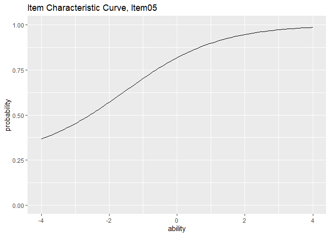
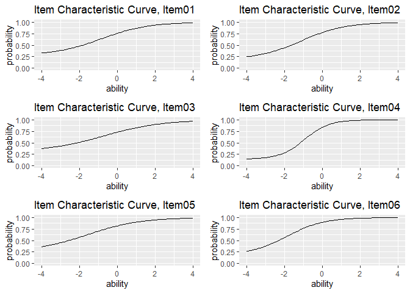
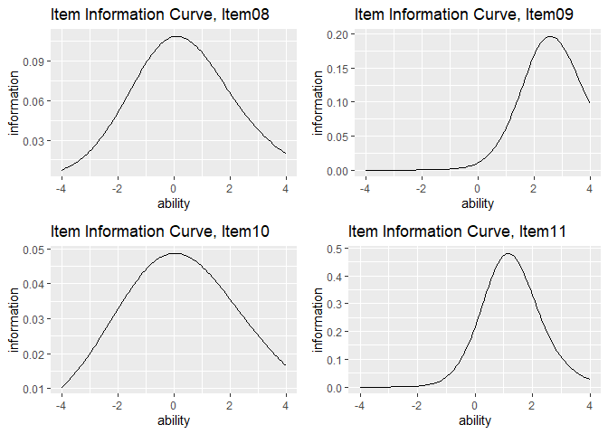

<!-- README.md is generated manually. -->

# ggExametrika

<!-- badges: start -->
<!-- badges: end -->

**ggExametrika** provides ggplot2-based visualization for the
[exametrika](https://kosugitti.github.io/exametrika/) package.
It supports a wide range of psychometric models:

| Model | Description |
|-------|-------------|
| **IRT** | Item Response Theory (2PL, 3PL, 4PL) |
| **GRM** | Graded Response Model |
| **LCA** | Latent Class Analysis |
| **LRA** | Latent Rank Analysis |
| **Biclustering** | Simultaneous item/student clustering |
| **IRM** | Infinite Relational Model |
| **LDLRA** | Locally Dependent Latent Rank Analysis |
| **LDB** | Locally Dependent Biclustering |
| **BINET** | Bayesian Network and Test |
| **BNM** | Bayesian Network Model |

## Reference

Shojima, Kojiro (2022) *Test Data Engineering: Latent Rank Analysis, Biclustering, and Bayesian Network*
(Behaviormetrics: Quantitative Approaches to Human Behavior, 13),
Springer, [https://amzn.to/42eNArd](https://amzn.to/42eNArd)

## Installation

``` r
# install.packages("devtools")
devtools::install_github("kosugitti/ggExametrika")
```

## Examples

All plot functions take exametrika output directly and return ggplot objects.
Functions are named `plotXXX_gg()`.

### IRT: Item Characteristic Curve (plotICC_gg)

``` r
library(exametrika)
library(ggExametrika)

result_irt <- IRT(J15S500, model = 3)
plots <- plotICC_gg(result_irt)
plots[[5]]
```



``` r
combinePlots_gg(plots)
```



### IRT: Item Information Curve (plotIIC_gg)

``` r
plots <- plotIIC_gg(result_irt)
combinePlots_gg(plots, selectPlots = 8:11)
```



### IRT: Test Information Curve / Test Response Function (plotTIC_gg, plotTRF_gg)

``` r
plotTIC_gg(result_irt)
plotTRF_gg(result_irt)
```

### GRM: Item Category Response Function (plotICRF_gg)

``` r
result_grm <- GRM(J5S1000)
plots <- plotICRF_gg(result_grm)
plots[[1]]
combinePlots_gg(plots, selectPlots = 1:5)

# GRM also supports IIC and TIC
plotIIC_gg(result_grm)
plotTIC_gg(result_grm)
```

### LCA: Latent Class Analysis

``` r
result_lca <- LCA(J15S500, ncls = 3)

plotIRP_gg(result_lca)         # Item Reference Profile
plotFRP_gg(result_lca)         # Field Reference Profile
plotTRP_gg(result_lca)         # Test Reference Profile
plotLCD_gg(result_lca)         # Latent Class Distribution
plotCMP_gg(result_lca)         # Class Membership Profile
```

### LRA: Latent Rank Analysis

``` r
result_lra <- LRA(J15S500, nrank = 4)

plotIRP_gg(result_lra)         # Item Reference Profile
plotFRP_gg(result_lra)         # Field Reference Profile
plotTRP_gg(result_lra)         # Test Reference Profile
plotLRD_gg(result_lra)         # Latent Rank Distribution
plotRMP_gg(result_lra)         # Rank Membership Profile
```

### Biclustering

``` r
result_bic <- Biclustering(J35S515, nfld = 5, nrank = 6)

plotFRP_gg(result_bic)         # Field Reference Profile
plotTRP_gg(result_bic)         # Test Reference Profile
plotLRD_gg(result_bic)         # Latent Rank Distribution
plotRMP_gg(result_bic)         # Rank Membership Profile
plotCRV_gg(result_bic)         # Class Reference Vector
plotRRV_gg(result_bic)         # Rank Reference Vector
plotArray_gg(result_bic)       # Array Plot (heatmap)
```

### LDB: Locally Dependent Biclustering

``` r
result_ldb <- LDB(J35S515, ncls = 6, nfld = 5)

plotFRP_gg(result_ldb)         # Field Reference Profile
plotTRP_gg(result_ldb)         # Test Reference Profile
plotLRD_gg(result_ldb)         # Latent Rank Distribution
plotRMP_gg(result_ldb)         # Rank Membership Profile
plotArray_gg(result_ldb)       # Array Plot
plotFieldPIRP_gg(result_ldb)   # Field Parent Item Reference Profile
plotGraph_gg(result_ldb)       # DAG per rank
```

### BINET: Bayesian Network and Test

``` r
result_binet <- BINET(J35S515, ncls = 6, nfld = 5)

plotFRP_gg(result_binet)       # Field Reference Profile
plotTRP_gg(result_binet)       # Test Reference Profile
plotLCD_gg(result_binet)       # Latent Class Distribution
plotCMP_gg(result_binet)       # Class Membership Profile
plotArray_gg(result_binet)     # Array Plot
plotGraph_gg(result_binet, show_edge_label = TRUE)  # DAG with edge labels
```

### BNM / LDLRA: DAG Visualization (plotGraph_gg)

``` r
result_bnm <- BNM(J15S500)
plotGraph_gg(result_bnm)

result_ldlra <- LDLRA(J15S500, ncls = 5)
plotGraph_gg(result_ldlra)     # One DAG per rank
```

## Function-Model Compatibility

| Function | IRT | GRM | LCA | LRA | Bic. | IRM | LDLRA | LDB | BINET | BNM |
|----------|:---:|:---:|:---:|:---:|:----:|:---:|:-----:|:---:|:-----:|:---:|
| plotICC_gg | x | | | | | | | | | |
| plotIIC_gg | x | x | | | | | | | | |
| plotTIC_gg | x | x | | | | | | | | |
| plotTRF_gg | x | | | | | | | | | |
| plotICRF_gg | | x | | | | | | | | |
| plotIRP_gg | | | x | x | | | x | | | |
| plotFRP_gg | | | | | x | x | | x | x | |
| plotTRP_gg | | | x | x | x | x | | x | x | |
| plotLCD_gg | | | x | | | | | | x | |
| plotLRD_gg | | | | x | x | | x | x | | |
| plotCMP_gg | | | x | | | | | | x | |
| plotRMP_gg | | | | x | x | | x | x | | |
| plotCRV_gg | | | | | x | | | | | |
| plotRRV_gg | | | | | x | | | | | |
| plotArray_gg | | | | | x | x | | x | x | |
| plotFieldPIRP_gg | | | | | | | | x | | |
| plotGraph_gg | | | | | | | x | x | x | x |

## Common Plot Options

Many functions support these customization options:

| Parameter | Description | Default |
|-----------|-------------|---------|
| `title` | `TRUE` (auto), `FALSE` (none), or character string | `TRUE` |
| `colors` | Color vector (colorblind-friendly default) | auto |
| `linetype` | `"solid"`, `"dashed"`, `"dotted"`, etc. | `"solid"` |
| `show_legend` | Show/hide legend | `TRUE` |
| `legend_position` | `"right"`, `"top"`, `"bottom"`, `"left"` | `"right"` |

## Documentation

- [Getting Started (English)](https://kosugitti.github.io/ggExametrika/articles/getting-started.html)
- [入門ガイド (日本語)](https://kosugitti.github.io/ggExametrika/articles/getting-started-ja.html)
- [Function Reference](https://kosugitti.github.io/ggExametrika/reference/index.html)
