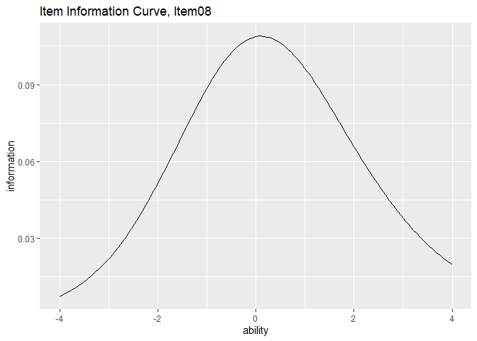
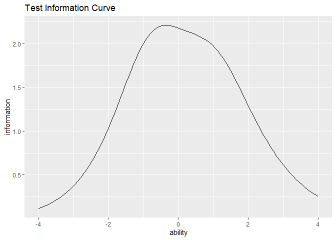

<!-- README.md is generated from README.Rmd. Please edit that file -->

# ggExametrika

<!-- badges: start -->

<!-- badges: end -->

[Exametrika](http://shojima.starfree.jp/exmk/index.htm) is a powerful
tool developed by Shojima(2022) for data analysis, available in
[Mathematica and an Excel
Add-on](http://shojima.starfree.jp/tde/index.htm). It has been developed
as an R package at <https://kosugitti.github.io/Exametrika/>. This
package, ggExametrika, is built to enhance the visualization
capabilities of Exametrika pacakge using ggplot functions. It integrates
seamlessly with the Exametrika package, providing beautiful and
logically arranged plots for simplified data interpretation in R.

# Reference

Shojima, Kojiro (2022) Test Data Engineering: Latent Rank Analysis,
Biclustering, andBayesian Network (Behaviormetrics: Quantitative
Approaches to Human Behavior, 13), Springer, <https://amzn.to/42eNArd>

## Installation

You can install the development version of ggExametrika from
[GitHub](https://github.com/) with:

``` r
# install.packages("devtools")
devtools::install_github("kosugitti/ggExametrika")
```

## Example

In this package, you can create plots using ggplot2 directly by
inputting the output results from Exametrika. The functions responsible
for generating plots are named in the format plotxxx_gg. Additionally,
there are options available to display multiple plots.

## plotICC_gg Example

plotICC_gg is specifically designed for the output of IRT. Below is an
example code using the Exametrika package. To run this code, you need
the Exametrika package.

``` r
library(exametrika)
library(ggExametrika)
#> Loading required package: ggplot2
#> Loading required package: gridExtra
#> 
#> Attaching package: 'ggExametrika'
#> The following objects are masked from 'package:exametrika':
#> 
#>     ItemInformationFunc, LogisticModel
result.IRT <- IRT(J15S500, model = 3)
#> iter 1 LogLik -3960.28
#> iter 2 LogLik -3938.35 iter 3 LogLik -3931.82 iter 4 LogLik -3928.68 iter 5
#> LogLik -3926.99 iter 6 LogLik -3926.05 iter 7 LogLik -3925.51 iter 8 LogLik
#> -3925.19 iter 9 LogLik -3925.01 iter 10 LogLik -3924.9 iter 11 LogLik -3924.83
#> iter 12 LogLik -3924.8 iter 13 LogLik -3924.77
result.IRT
#> Item Parameters
#>        slope location lowerAsym PSD(slope) PSD(location) PSD(lowerAsym)
#> Item01 0.818   -0.834    0.2804      0.182         0.628         0.1702
#> Item02 0.860   -1.119    0.1852      0.157         0.471         0.1488
#> Item03 0.657   -0.699    0.3048      0.162         0.798         0.1728
#> Item04 1.550   -0.949    0.1442      0.227         0.216         0.1044
#> Item05 0.721   -1.558    0.2584      0.148         0.700         0.1860
#> Item06 1.022   -1.876    0.1827      0.171         0.423         0.1577
#> Item07 1.255   -0.655    0.1793      0.214         0.289         0.1165
#> Item08 0.748   -0.155    0.1308      0.148         0.394         0.1077
#> Item09 1.178    2.287    0.2930      0.493         0.423         0.0440
#> Item10 0.546   -0.505    0.2221      0.131         0.779         0.1562
#> Item11 1.477    1.090    0.0628      0.263         0.120         0.0321
#> Item12 1.479    1.085    0.0462      0.245         0.115         0.0276
#> Item13 0.898   -0.502    0.0960      0.142         0.272         0.0858
#> Item14 1.418   -0.788    0.2260      0.248         0.291         0.1252
#> Item15 0.908   -0.812    0.1531      0.159         0.383         0.1254
#> 
#> Item Fit Indices
#>        model_log_like bench_log_like null_log_like model_Chi_sq null_Chi_sq
#> Item01       -262.979       -240.190      -283.343       45.578      86.307
#> Item02       -253.405       -235.436      -278.949       35.937      87.025
#> Item03       -280.640       -260.906      -293.598       39.468      65.383
#> Item04       -204.884       -192.072      -265.962       25.623     147.780
#> Item05       -232.135       -206.537      -247.403       51.196      81.732
#> Item06       -173.669       -153.940      -198.817       39.459      89.755
#> Item07       -250.905       -228.379      -298.345       45.053     139.933
#> Item08       -314.781       -293.225      -338.789       43.111      91.127
#> Item09       -321.920       -300.492      -327.842       42.856      54.700
#> Item10       -309.318       -288.198      -319.850       42.240      63.303
#> Item11       -248.409       -224.085      -299.265       48.647     150.360
#> Item12       -238.877       -214.797      -293.598       48.160     157.603
#> Item13       -293.472       -262.031      -328.396       62.882     132.730
#> Item14       -223.473       -204.953      -273.212       37.040     136.519
#> Item15       -271.903       -254.764      -302.847       34.279      96.166
#>        model_df null_df   NFI   RFI   IFI   TLI   CFI RMSEA    AIC    CAIC
#> Item01       11      13 0.472 0.376 0.541 0.443 0.528 0.079 23.578 -22.805
#> Item02       11      13 0.587 0.512 0.672 0.602 0.663 0.067 13.937 -32.446
#> Item03       11      13 0.396 0.287 0.477 0.358 0.457 0.072 17.468 -28.915
#> Item04       11      13 0.827 0.795 0.893 0.872 0.892 0.052  3.623 -42.759
#> Item05       11      13 0.374 0.260 0.432 0.309 0.415 0.086 29.196 -17.186
#> Item06       11      13 0.560 0.480 0.639 0.562 0.629 0.072 17.459 -28.924
#> Item07       11      13 0.678 0.620 0.736 0.683 0.732 0.079 23.053 -23.330
#> Item08       11      13 0.527 0.441 0.599 0.514 0.589 0.076 21.111 -25.272
#> Item09       11      13 0.217 0.074 0.271 0.097 0.236 0.076 20.856 -25.527
#> Item10       11      13 0.333 0.211 0.403 0.266 0.379 0.075 20.240 -26.143
#> Item11       11      13 0.676 0.618 0.730 0.676 0.726 0.083 26.647 -19.736
#> Item12       11      13 0.694 0.639 0.747 0.696 0.743 0.082 26.160 -20.222
#> Item13       11      13 0.526 0.440 0.574 0.488 0.567 0.097 40.882  -5.501
#> Item14       11      13 0.729 0.679 0.793 0.751 0.789 0.069 15.040 -31.343
#> Item15       11      13 0.644 0.579 0.727 0.669 0.720 0.065 12.279 -34.104
#>            BIC
#> Item01 -22.783
#> Item02 -32.424
#> Item03 -28.893
#> Item04 -42.737
#> Item05 -17.164
#> Item06 -28.902
#> Item07 -23.308
#> Item08 -25.250
#> Item09 -25.505
#> Item10 -26.121
#> Item11 -19.714
#> Item12 -20.200
#> Item13  -5.479
#> Item14 -31.321
#> Item15 -34.082
#> 
#> Model Fit Indices
#>                    value
#> model_log_like -3880.769
#> bench_log_like -3560.005
#> null_log_like  -4350.217
#> model_Chi_sq     641.528
#> null_Chi_sq     1580.424
#> model_df         165.000
#> null_df          195.000
#> NFI                0.594
#> RFI                0.520
#> IFI                0.663
#> TLI                0.594
#> CFI                0.656
#> RMSEA              0.076
#> AIC              311.528
#> CAIC            -384.212
#> BIC             -383.883
```

If you want to plot ICC, input the stored results directly into the
plotICC_gg function. You can also specify the range of the X-axis with a
vector. If no specific range is provided, it will be plotted in the
range from -4 to 4, and the function will return a list.

``` r
plots <- plotICC_gg(result.IRT)
# If you want to specify a range, provide a vector for the xvariable argument.
# plotICC_gg(result.IRT,xvariable = c(-7, 7))
```

This way, the ICC for each item is stored in a list called plots. If you
want to see the figures, you can specify it as follows. Also, if you
want to draw multiple figures simultaneously, you can use the
combinePlots_gg() function.

``` r
# Draw the ICC for Item5.
plots[5]
#> [[1]]
```


``` r

# Output multiple plots simultaneously (default is 6). Refer to the combinePlots_gg() documentation for specifying the figures.
combinePlots_gg(plots)
```


## plotIIC_gg Example

You can also plot the Item Information Curve (IIC) similar to the
plotICC_gg function. Input the output from the Exametrika package into
the plotIIC_gg function as before.

``` r
plots <- plotIIC_gg(result.IRT)
# If you wish to specify a range, please provide a vector for the xvariable argument. The x-axis does not necessarily have to be symmetric around 0 for plotting.
# plotIIC_gg(result.IRT,xvariable = c(-5, 7))
# plotIIC_gg(result.IRT,xvariable = c(2, 9))
```

In this method, the IIC for each item is stored in a list called plots.
If you want to view the figures, you can specify it as follows. Also, if
you wish to draw multiple figures simultaneously, you can use the
combinePlots_gg() function.

``` r
# Draw the IIC for Item8.
plots[8]
#> [[1]]
```



``` r

# We will output multiple plots simultaneously (default is 6). This time, we will display 4 plots from the 8th to the 11th.
combinePlots_gg(plots, selectPlots = c(8:11))
```


## plotTIC_gg Example

You can also plot the Test Information Curve using the same procedure.
Subsequent functions may have differences in their arguments, but they
are generally used in the same way. If you input data into a plotting
function that does not fit the model, an error will occur, so please
check the compatibility between the model and the plotting function.

``` r
plot <- plotTIC_gg(result.IRT)
# If you wish to specify a range, please provide a vector for the xvariable argument. The x-axis does not necessarily have to be symmetric around 0 for plotting.
```

Since we are dealing with the information curve for a single test this
time, only one plot will be generated.

``` r
# Draw the IIC for Item8.
plot
```


