# ggExametrika 入門ガイド

## 概要

**ggExametrika**
は、[exametrika](https://kosugitti.github.io/Exametrika/)
パッケージの出力をggplot2で可視化するためのパッケージです。
IRT、GRM、潜在クラス・ランク分析、バイクラスタリング、ベイジアンネットワークモデルなど、
幅広い心理測定モデルに対応しています。

## インストール

``` r
# GitHubからインストール
devtools::install_github("kosugitti/ggExametrika")
```

## 準備

``` r
library(exametrika)
library(ggExametrika)
#> Loading required package: ggplot2
#> 
#> Attaching package: 'ggExametrika'
#> The following objects are masked from 'package:exametrika':
#> 
#>     ItemInformationFunc, LogisticModel
```

------------------------------------------------------------------------

## 1. IRT（項目反応理論）

IRT（2PL, 3PL,
4PL）モデルは、2値応答データから項目パラメータを推定します。

``` r
result_irt <- IRT(J15S500, model = 2)
#> No ID column detected. All columns treated as response data. Sequential IDs (Student1, Student2, ...) were generated. Use id= parameter to specify the ID column explicitly.
#> No ID column detected. All columns treated as response data. Sequential IDs (Student1, Student2, ...) were generated. Use id= parameter to specify the ID column explicitly.
#> iter 1 LogLik -3915.61 iter 2 LogLik -3901.1 iter 3 LogLik -3896.89 iter 4
#> LogLik -3894.98 iter 5 LogLik -3894.02 iter 6 LogLik -3893.53 iter 7 LogLik
#> -3893.28 iter 8 LogLik -3893.15 iter 9 LogLik -3893.08 iter 10 LogLik -3893.04
#> iter 11 LogLik -3893.03
```

### plotICC_gg: 項目特性曲線（ICC）

能力（theta）の関数として正答確率を表示します。

``` r
# 項目ごとにプロットのリストを返す
icc_plots <- plotICC_gg(result_irt)
icc_plots[[1]] # 1番目の項目を表示
```

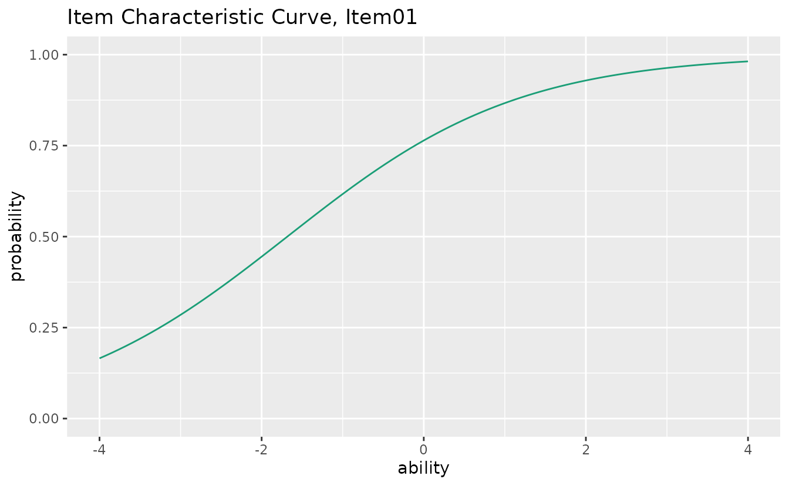

[`combinePlots_gg()`](https://kosugitti.github.io/ggExametrika/reference/combinePlots_gg.md)
で複数項目を一度に表示:

``` r
combinePlots_gg(icc_plots, selectPlots = 1:6)
```


能力の範囲をカスタマイズ:

``` r
icc_plots <- plotICC_gg(result_irt, xvariable = c(-3, 3))
```

### plotIIC_gg: 項目情報曲線（IIC）

各項目がどの能力レベルでどの程度の測定精度を持つかを表示します。

``` r
iic_plots <- plotIIC_gg(result_irt)
iic_plots[[1]]
```

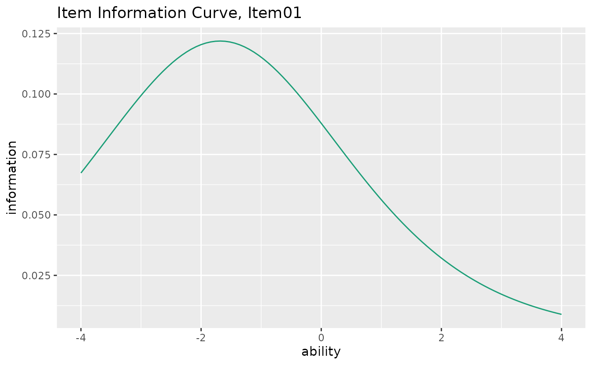

``` r
combinePlots_gg(iic_plots, selectPlots = 1:6)
```


特定の項目を選択:

``` r
iic_plots <- plotIIC_gg(result_irt, items = c(1, 3, 5))
```

### plotTIC_gg: テスト情報曲線（TIC）

全項目の情報量の合計（テスト情報関数）を表示します。

``` r
tic_plot <- plotTIC_gg(result_irt)
tic_plot
```

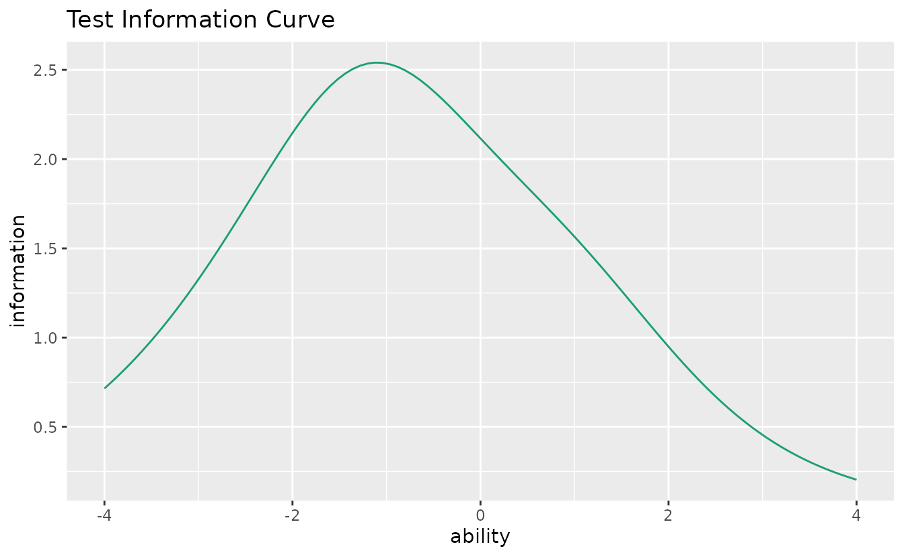

外観のカスタマイズ:

``` r
plotTIC_gg(result_irt,
  title = "カスタムタイトル",
  colors = "darkred",
  linetype = "dashed"
)
```

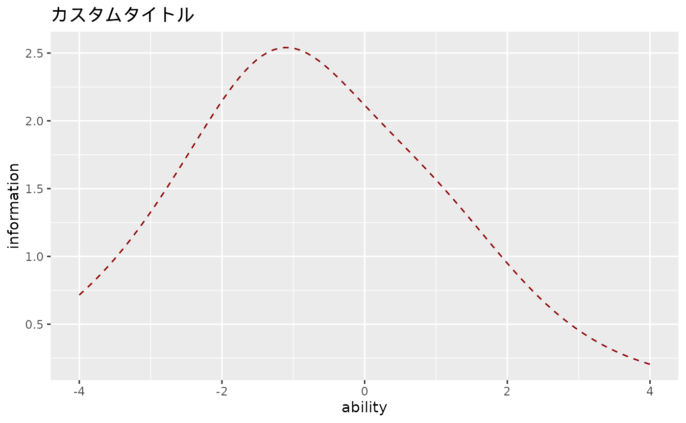

### plotTRF_gg: テスト応答関数（TRF）

能力の関数として期待総得点を表示します。

``` r
trf_plot <- plotTRF_gg(result_irt)
trf_plot
```

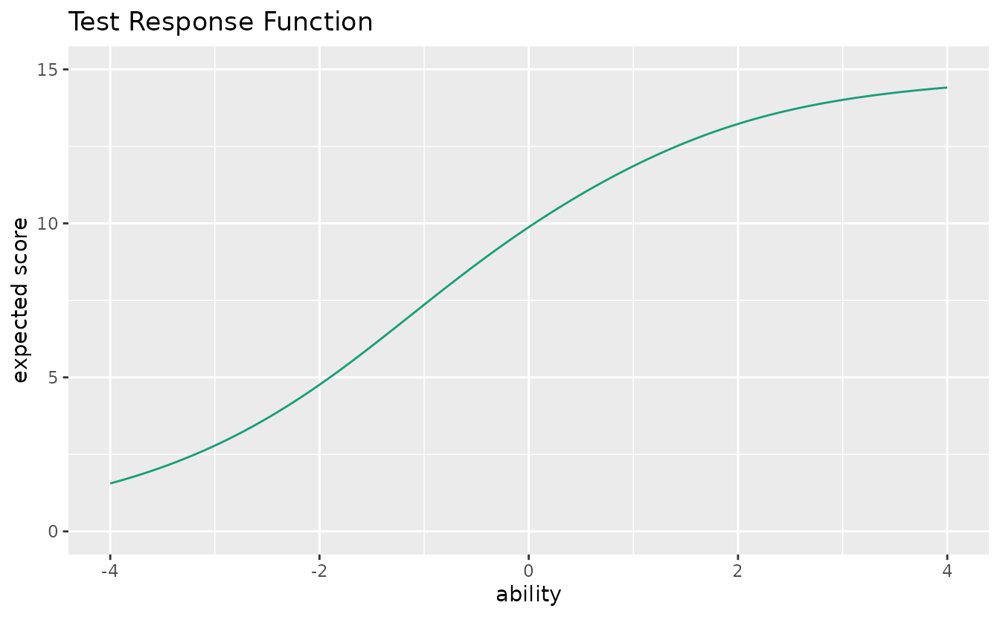

### plotICC_overlay_gg: ICC オーバーレイ

全項目の項目特性曲線を1つのグラフに重ねて表示し、項目間の比較を容易にします。

``` r
plotICC_overlay_gg(result_irt)
```


特定の項目を選択してカスタマイズ:

``` r
plotICC_overlay_gg(result_irt,
  items = c(1, 3, 5, 7),
  title = "選択した項目のICC",
  linetype = "solid",
  legend_position = "bottom"
)
```

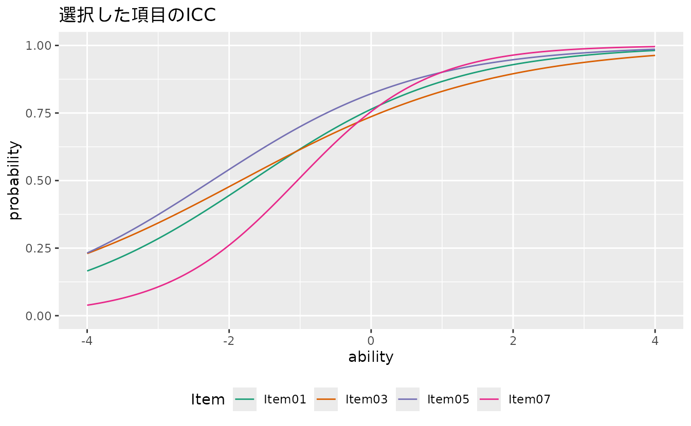

### plotIIC_overlay_gg: IIC オーバーレイ

全項目の項目情報曲線を1つのグラフに重ねて表示します。

``` r
plotIIC_overlay_gg(result_irt)
```

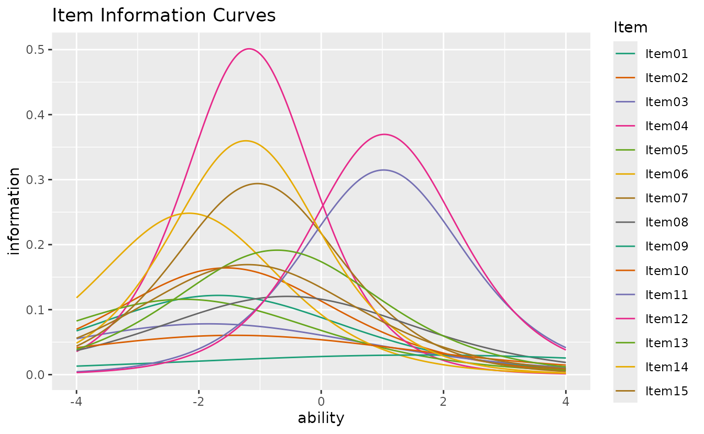

GRMデータにも対応しています（セクション2参照）。

### LogisticModel / ItemInformationFunc: 補助関数

IRTモデルの低レベル計算関数です。

``` r
# 4パラメータロジスティックモデル: P(theta)
LogisticModel(x = 0, a = 1.5, b = 0.5, c = 0.2, d = 1.0)
#> [1] 0.456657

# 指定したthetaでの項目情報量
ItemInformationFunc(x = 0, a = 1.5, b = 0.5, c = 0.2, d = 1.0)
#> [1] 0.2755452
```

------------------------------------------------------------------------

## 2. GRM（段階反応モデル）

GRMは順序付き多値応答データ（例: リッカート尺度）を扱います。

``` r
result_grm <- GRM(J5S1000)
#> Parameters: 18 | Initial LL: -6252.352 
#> initial  value 6252.351598 
#> iter  10 value 6032.463982
#> iter  20 value 6010.861094
#> final  value 6008.297278 
#> converged
```

### plotICRF_gg: 項目カテゴリ応答関数（ICRF）

能力の関数として各応答カテゴリの選択確率を表示します。

``` r
icrf_plots <- plotICRF_gg(result_grm)
icrf_plots[[1]]
```

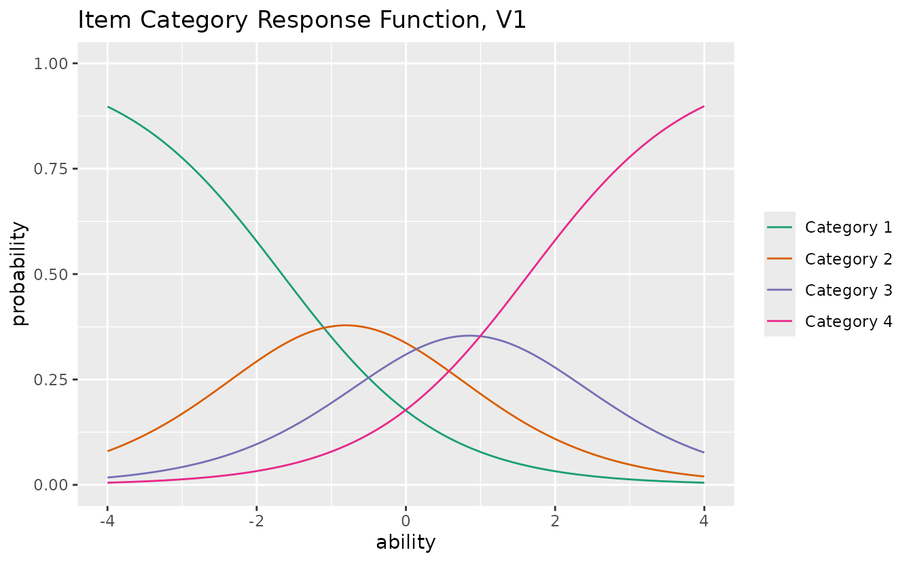

``` r
combinePlots_gg(icrf_plots, selectPlots = 1:5)
```

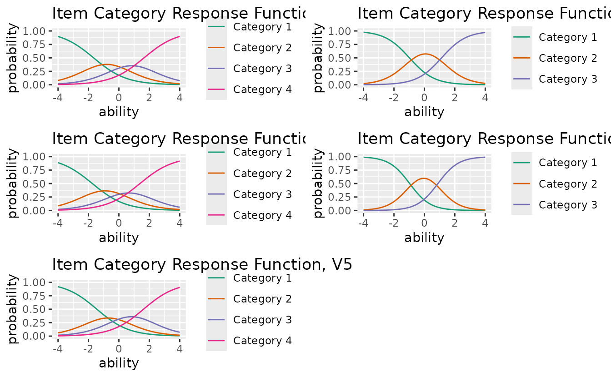

特定の項目を選択してカスタマイズ:

``` r
plotICRF_gg(result_grm,
  items = c(1, 2),
  title = "項目1-2のICRF",
  colors = c("#E41A1C", "#377EB8", "#4DAF4A", "#984EA3", "#FF7F00"),
  linetype = "solid",
  show_legend = TRUE,
  legend_position = "bottom"
)
#> [[1]]
```

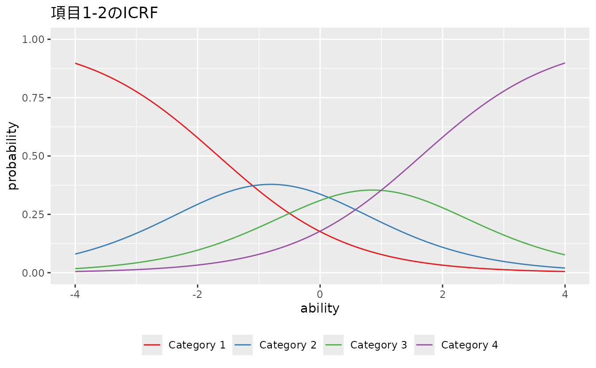

    #> 
    #> [[2]]

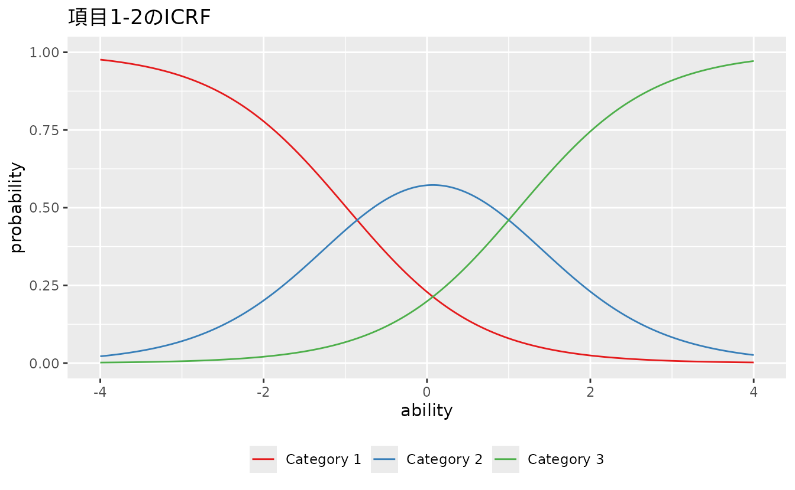

### plotIIC_gg（GRM版）: 項目情報曲線

GRMデータにも対応しています:

``` r
iic_grm <- plotIIC_gg(result_grm)
iic_grm[[1]]
```


``` r
combinePlots_gg(iic_grm, selectPlots = 1:5)
```


### plotTIC_gg（GRM版）: テスト情報曲線

``` r
tic_grm <- plotTIC_gg(result_grm)
tic_grm
```


### ItemInformationFunc_GRM: 補助関数

``` r
# 5カテゴリ項目の theta = 0 での情報量
ItemInformationFunc_GRM(theta = 0, a = 1.5, b = c(-1.5, -0.5, 0.5, 1.5))
#> [1] 1.368688
```

------------------------------------------------------------------------

## 3. LCA（潜在クラス分析）

LCAは2値応答データから潜在クラス（離散的グループ）を識別します。

``` r
result_lca <- LCA(J15S500, ncls = 3)
#> iter 1 log_lik -3955.4 iter 2 log_lik -3904.63 iter 3 log_lik -3890.82 iter 4
#> log_lik -3880 iter 5 log_lik -3870.82 iter 6 log_lik -3863.52 iter 7 log_lik
#> -3857.89 iter 8 log_lik -3853.58 iter 9 log_lik -3850.31 iter 10 log_lik
#> -3847.86 iter 11 log_lik -3846.05 iter 12 log_lik -3844.72 iter 13 log_lik
#> -3843.74 iter 14 log_lik -3843.02 iter 15 log_lik -3842.48 iter 16 log_lik
#> -3842.07 iter 17 log_lik -3841.76
```

### plotIRP_gg: 項目参照プロファイル（IRP）

各潜在クラスにおける各項目の正答確率を表示します。

``` r
irp_plots <- plotIRP_gg(result_lca)
irp_plots[[1]]
```


``` r
combinePlots_gg(irp_plots, selectPlots = 1:6)
```


### plotTRP_gg: テスト参照プロファイル（TRP）

クラスごとの学生数と期待テスト得点を表示します。

``` r
trp_plot <- plotTRP_gg(result_lca)
trp_plot
```

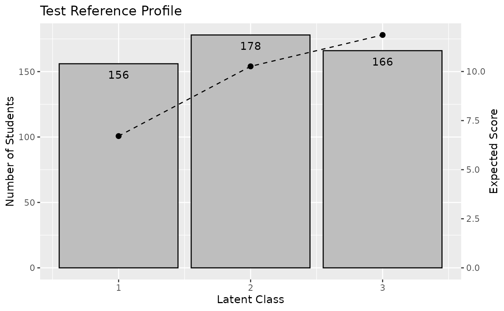

学生数ラベルやタイトルを非表示にする:

``` r
plotTRP_gg(result_lca, Num_Students = FALSE, title = FALSE)
```

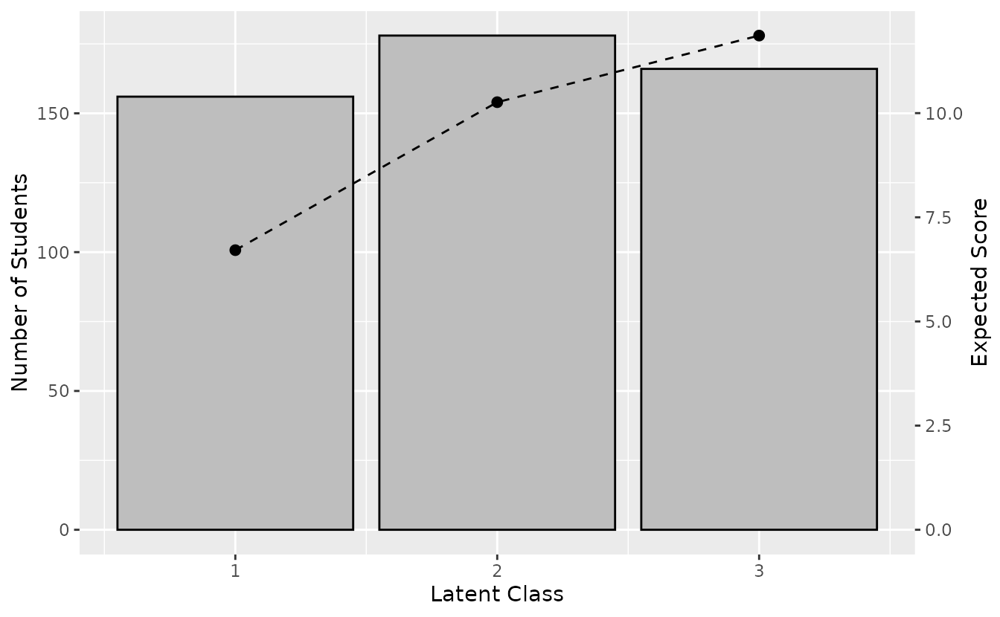

### plotLCD_gg: 潜在クラス分布（LCD）

クラス帰属度の分布を表示します。

``` r
lcd_plot <- plotLCD_gg(result_lca)
lcd_plot
```

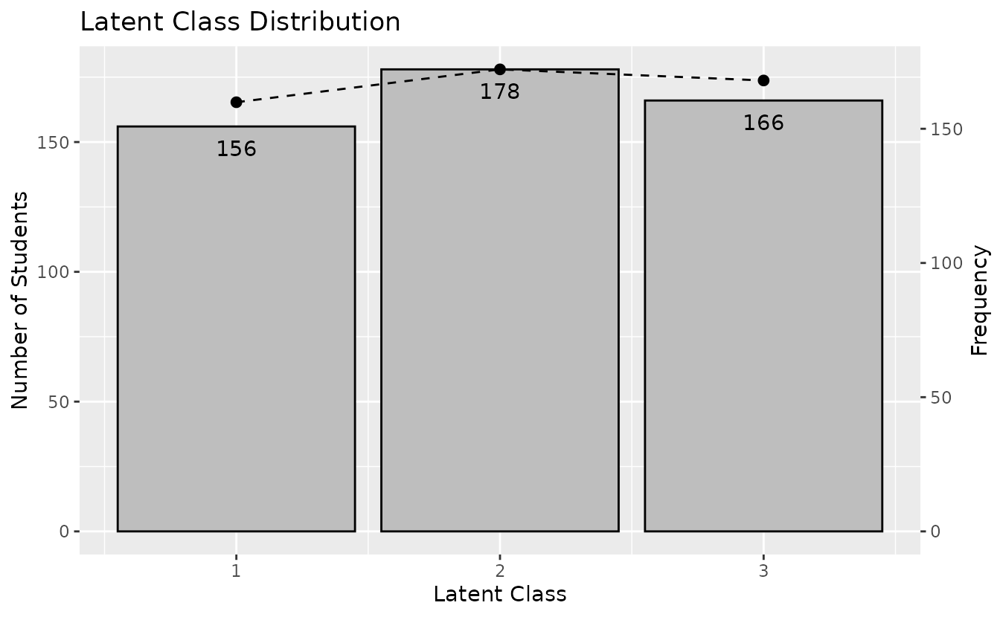

### plotCMP_gg: クラスメンバーシッププロファイル（CMP）

各学生の全クラスに対する帰属確率プロファイルを表示します。

``` r
# 学生ごとにプロットのリストを返す
cmp_plots <- plotCMP_gg(result_lca)
cmp_plots[[1]] # 1人目の学生
```


``` r
combinePlots_gg(cmp_plots, selectPlots = 1:6)
```

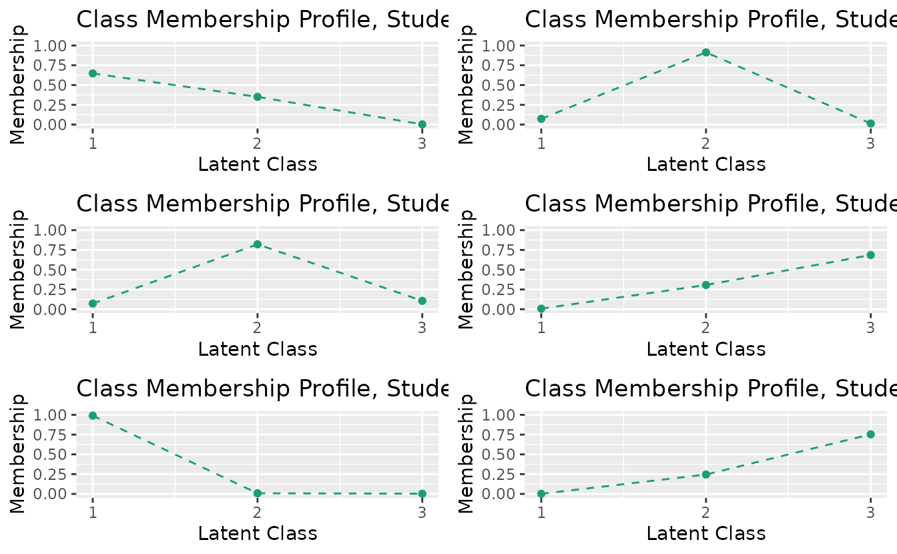

------------------------------------------------------------------------

## 4. LRA（潜在ランク分析）

LRAは2値応答データから順序付きの潜在ランクを識別します。

``` r
result_lra <- LRA(J15S500, nrank = 4)
```

### plotIRP_gg: 項目参照プロファイル

``` r
irp_plots <- plotIRP_gg(result_lra)
combinePlots_gg(irp_plots, selectPlots = 1:6)
```

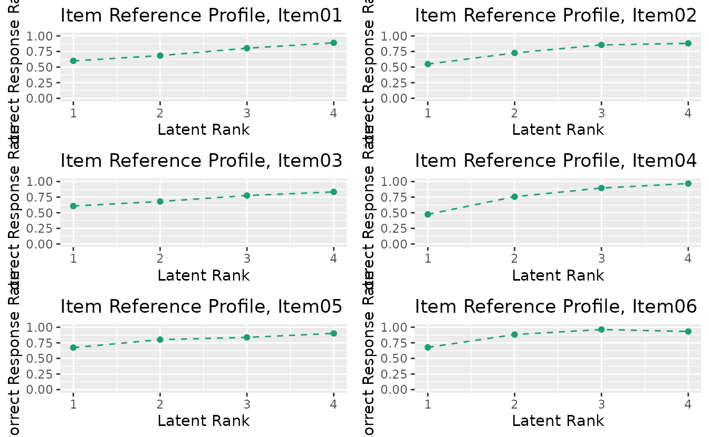

### plotTRP_gg: テスト参照プロファイル

``` r
trp_plot <- plotTRP_gg(result_lra)
trp_plot
```


### plotLRD_gg: 潜在ランク分布（LRD）

ランク帰属度の分布を表示します。

``` r
lrd_plot <- plotLRD_gg(result_lra)
lrd_plot
```

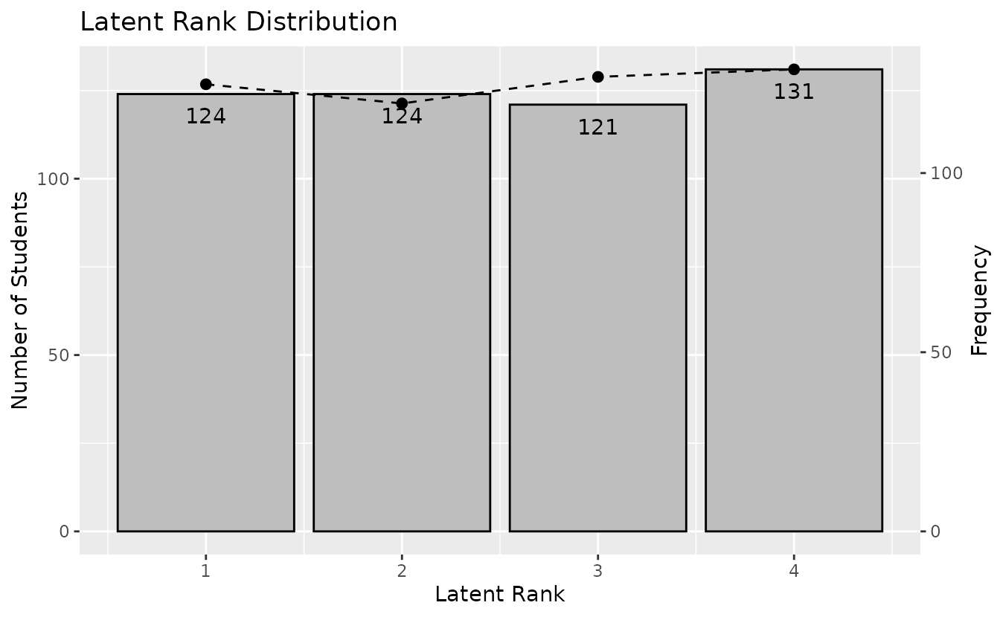

### plotRMP_gg: ランクメンバーシッププロファイル（RMP）

各学生の全ランクに対する帰属確率プロファイルを表示します。

``` r
rmp_plots <- plotRMP_gg(result_lra)
rmp_plots[[1]]
```


``` r
combinePlots_gg(rmp_plots, selectPlots = 1:6)
```

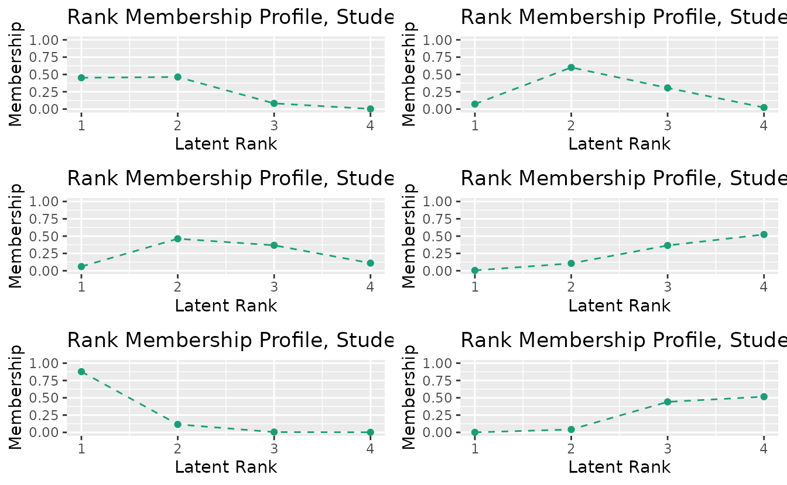

------------------------------------------------------------------------

## 4b. LRAordinal / LRArated（多値潜在ランク分析）

LRAordinalとLRAratedは、順序尺度や評定尺度の多値応答データを扱い、
得点分布やカテゴリレベルの分析に特化した可視化を提供します。

``` r
result_lra_ord <- LRA(J15S3810, nrank = 4, dataType = "ordinal")
```

### plotScoreFreq_gg: 得点頻度分布

得点の密度分布と、隣接するランク間の閾値を垂直線で表示します。

``` r
plotScoreFreq_gg(result_lra_ord)
```


色と線の種類をカスタマイズ:

``` r
plotScoreFreq_gg(result_lra_ord,
  title = "ランク境界付き得点分布",
  colors = c("steelblue", "red"),
  linetype = c("solid", "dashed")
)
```

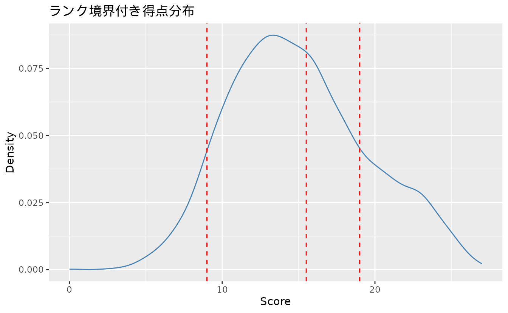

### plotScoreRank_gg: 得点-ランクヒートマップ

観測得点と推定ランクの同時分布をヒートマップで表示します。
色が濃いほど頻度が高いことを示します。

``` r
plotScoreRank_gg(result_lra_ord)
```

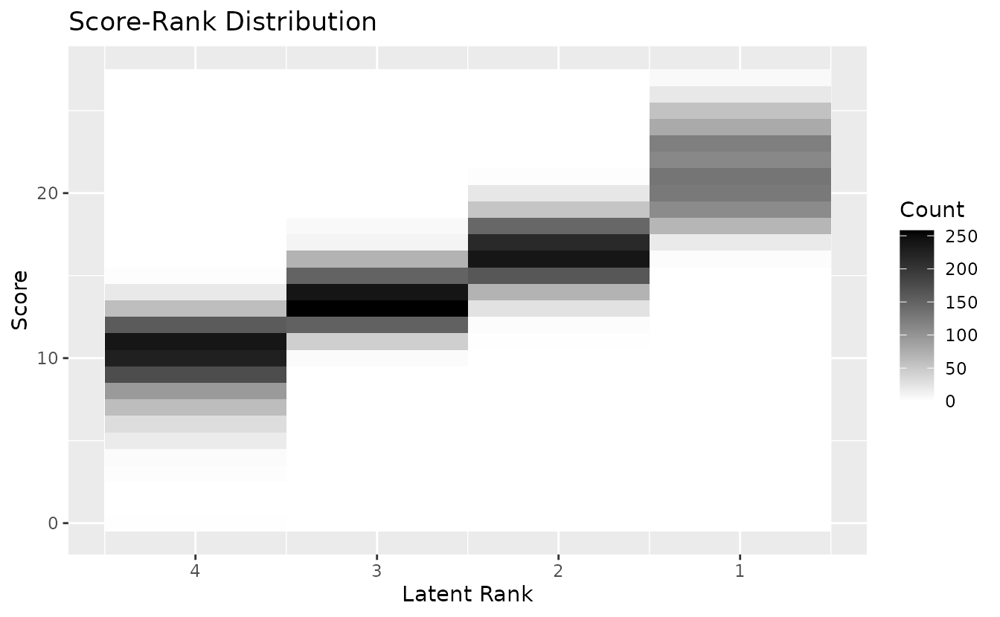

グラデーション色のカスタマイズ:

``` r
plotScoreRank_gg(result_lra_ord,
  title = "得点-ランク分布",
  colors = c("white", "darkblue"),
  legend_position = "bottom"
)
```

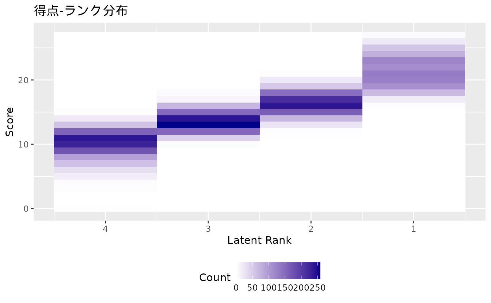

### plotICRP_gg: 項目カテゴリ参照プロファイル（ICRP）

各潜在ランクにおける各応答カテゴリの選択確率を表示します。
各ランクでの確率の合計は1.0になります。

``` r
icrp_plots <- plotICRP_gg(result_lra_ord, items = 1:4)
icrp_plots
```

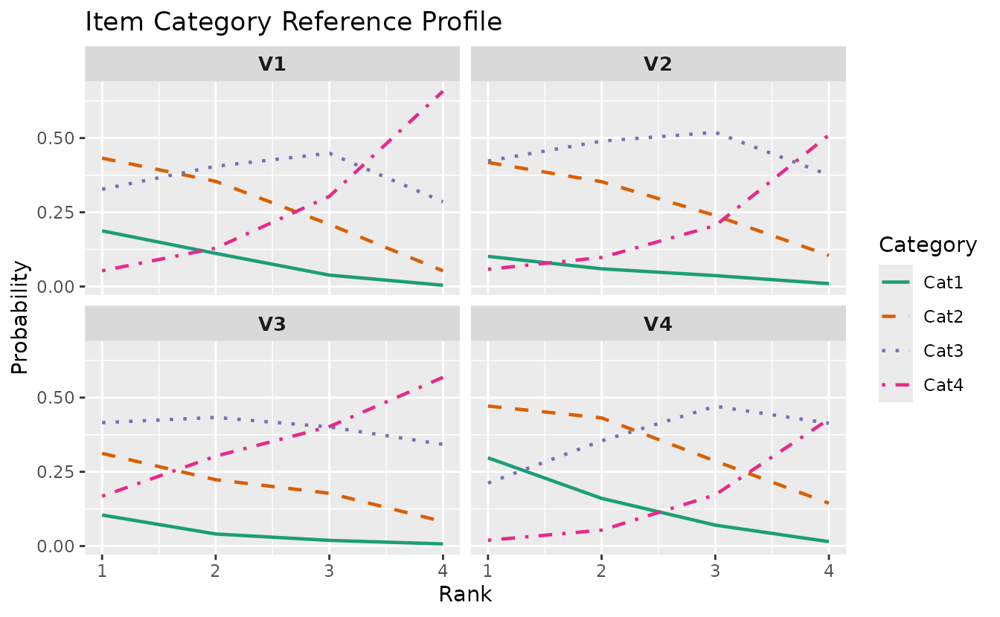

### plotICBR_gg: 項目カテゴリ境界応答（ICBR）

各カテゴリ境界の累積確率曲線を表示します。
K個のカテゴリを持つ項目に対して、P(応答 \>= k)（k = 1, …,
K-1）を表示します。

``` r
icbr_plots <- plotICBR_gg(result_lra_ord, items = 1:4)
icbr_plots
```


カスタマイズ:

``` r
plotICBR_gg(result_lra_ord,
  items = 1:6,
  title = "項目カテゴリ境界応答",
  legend_position = "bottom"
)
```

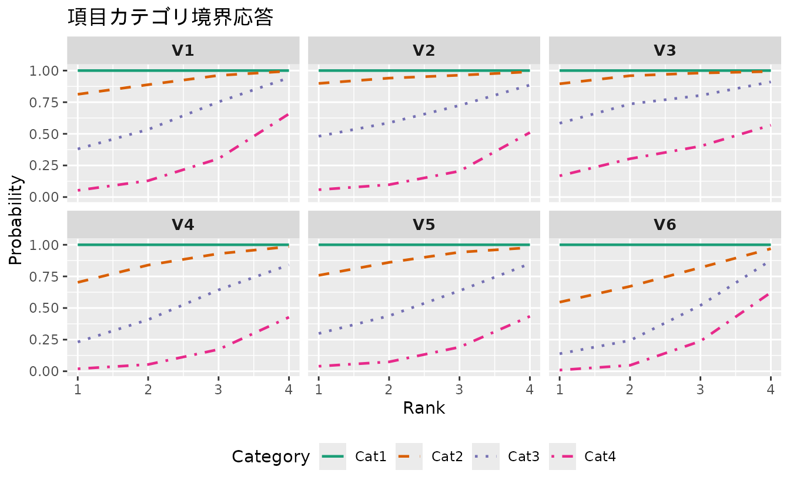

### plotRMP_gg: ランクメンバーシッププロファイル

LRAordinal/LRAratedでも使用可能:

``` r
rmp_plots <- plotRMP_gg(result_lra_ord)
rmp_plots[[1]]
```

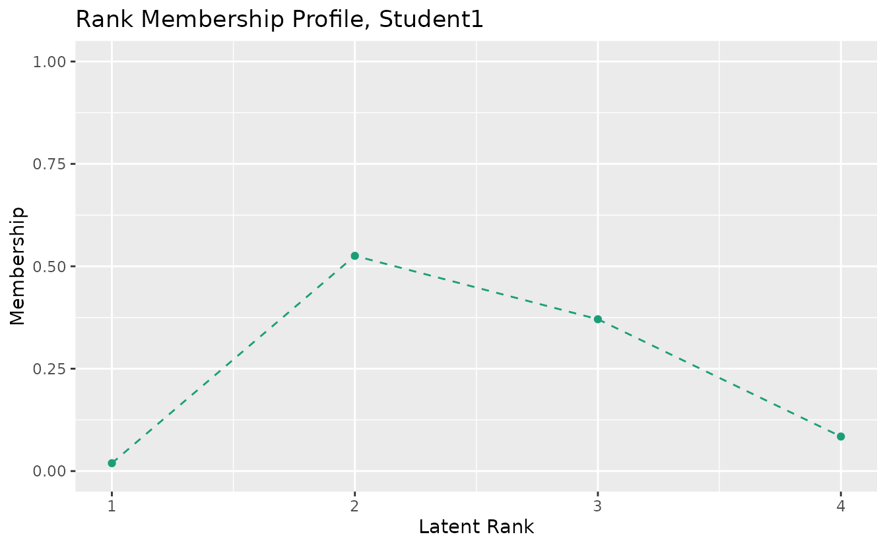

------------------------------------------------------------------------

## 5. バイクラスタリング

バイクラスタリングは、項目（フィールドへ）と学生（ランクへ）を同時にクラスタリングします。

``` r
result_bic <- Biclustering(J35S515, nfld = 5, nrank = 6)
#> Biclustering is chosen.
#> iter 1 log_lik -8463.81                                                         iter 2 log_lik -8195.78                                                         iter 3 log_lik -8121.09                                                         iter 4 log_lik -8091.3                                                          iter 5 log_lik -8086.61                                                         iter 6 log_lik -8086.47                                                         
#> 
#> Strongly ordinal alignment condition was satisfied.
#> No ID column detected. All columns treated as response data. Sequential IDs (Student1, Student2, ...) were generated. Use id= parameter to specify the ID column explicitly.
```

### plotFRP_gg: フィールド参照プロファイル

``` r
frp_plot <- plotFRP_gg(result_bic)
frp_plot
```


### plotTRP_gg: テスト参照プロファイル

``` r
trp_plot <- plotTRP_gg(result_bic)
trp_plot
```


### plotLRD_gg: 潜在ランク分布

``` r
lrd_plot <- plotLRD_gg(result_bic)
lrd_plot
```


### plotRMP_gg: ランクメンバーシッププロファイル

``` r
rmp_plots <- plotRMP_gg(result_bic)
combinePlots_gg(rmp_plots, selectPlots = 1:6)
```


### plotCRV_gg: クラス参照ベクトル（CRV）

全クラスのプロファイルを1つのプロットにまとめて表示します（クラスごとに異なる線）。

``` r
crv_plot <- plotCRV_gg(result_bic)
crv_plot
```

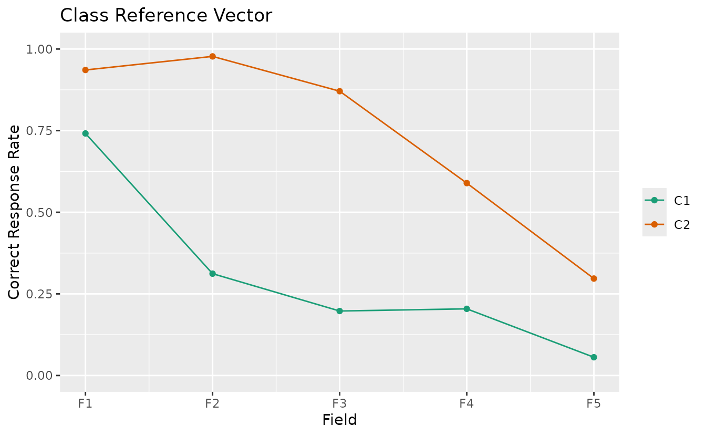

カスタマイズ:

``` r
plotCRV_gg(result_bic,
  title = "クラス参照ベクトル",
  linetype = "dashed",
  legend_position = "bottom"
)
```

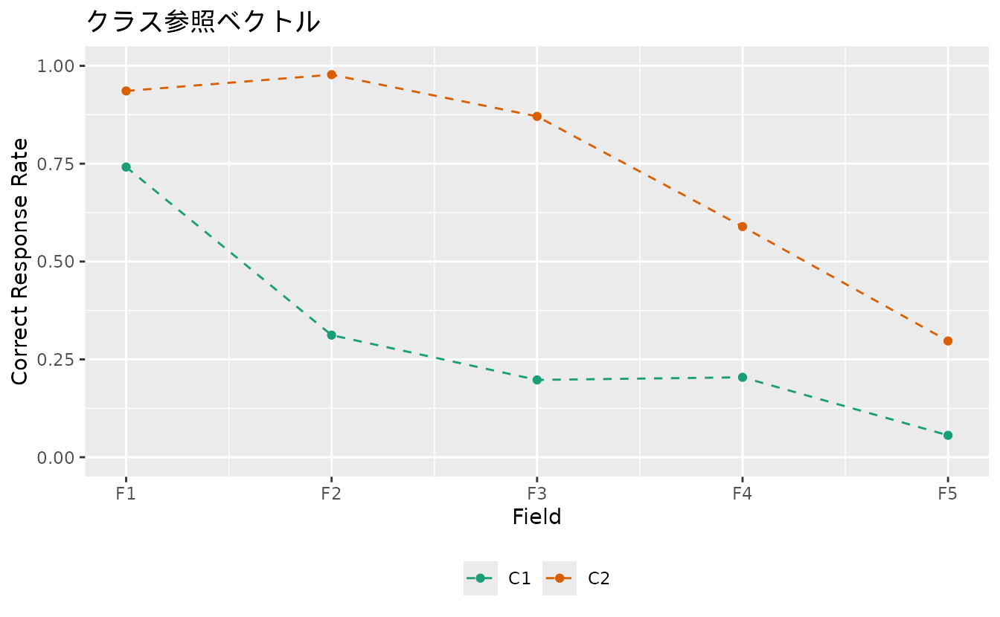

### plotRRV_gg: ランク参照ベクトル（RRV）

全ランクのプロファイルを1つのプロットにまとめて表示します（ランクごとに異なる線）。

``` r
rrv_plot <- plotRRV_gg(result_bic)
rrv_plot
```

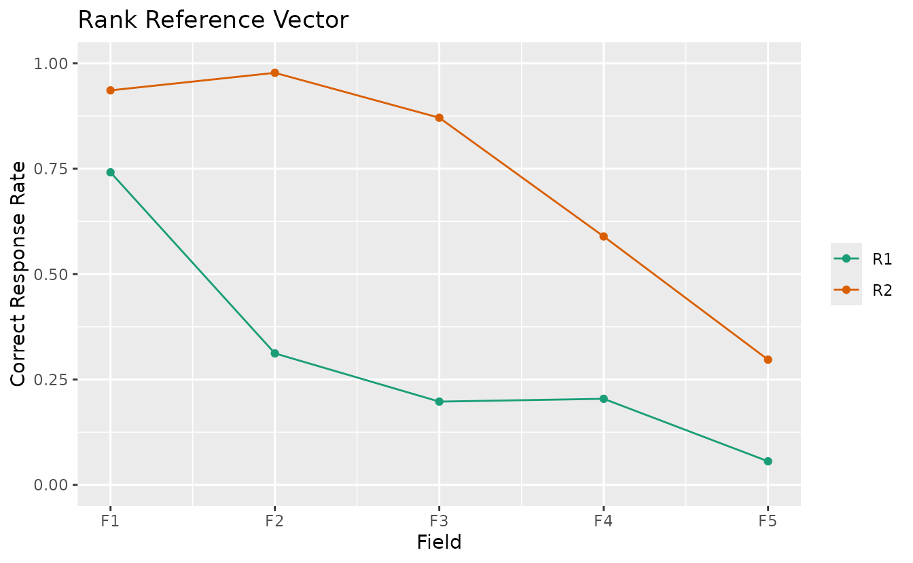

### plotArray_gg: 配列プロット

2値データ行列をヒートマップとして可視化し、バイクラスタリング後のブロック対角構造を示します。

``` r
# 元データとクラスタリング済みデータの両方を表示
array_plot <- plotArray_gg(result_bic)
```


``` r
array_plot
#> TableGrob (1 x 2) "arrange": 2 grobs
#>   z     cells    name           grob
#> 1 1 (1-1,1-1) arrange gtable[layout]
#> 2 2 (1-1,2-2) arrange gtable[layout]
```

クラスタリング済みデータのみ表示:

``` r
plotArray_gg(result_bic, Original = FALSE, Clusterd = TRUE)
#> [[1]]
```


クラスタ境界線を非表示:

``` r
plotArray_gg(result_bic, Clusterd_lines = FALSE)
```

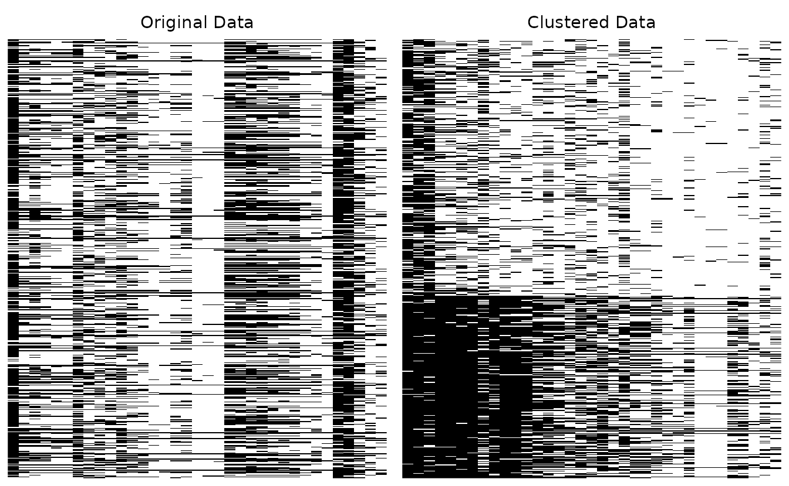

    #> TableGrob (1 x 2) "arrange": 2 grobs
    #>   z     cells    name           grob
    #> 1 1 (1-1,1-1) arrange gtable[layout]
    #> 2 2 (1-1,2-2) arrange gtable[layout]

### 順序尺度バイクラスタリング: plotFCBR_gg

順序尺度（多値）のバイクラスタリングでは、[`plotFCBR_gg()`](https://kosugitti.github.io/ggExametrika/reference/plotFCBR_gg.md)
でフィールド累積境界参照を 可視化できます。各フィールドの境界確率 P(Q
\>= k) を潜在クラス/ランクごとに表示します。

``` r
result_ord_bic <- Biclustering(J35S500, ncls = 5, nfld = 5)
#> Biclustering is chosen.
#> iter 1 log_lik -22710.5 iter 2 log_lik -21311.9 iter 3 log_lik -21002.5 iter 4
#> log_lik -20945.8 iter 5 log_lik -20932.3 iter 6 log_lik -20929.2 iter 7 log_lik
#> -20929.8
```

``` r
fcbr_plot <- plotFCBR_gg(result_ord_bic)
fcbr_plot
```


特定のフィールドを選択してカスタマイズ:

``` r
plotFCBR_gg(result_ord_bic,
  fields = 1:4,
  title = "フィールド累積境界参照",
  legend_position = "bottom"
)
```

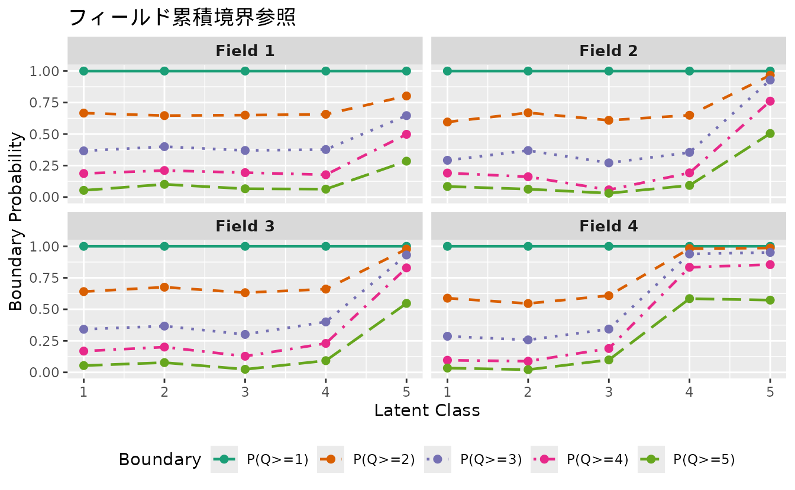

------------------------------------------------------------------------

## 6. BNM（ベイジアンネットワークモデル）

BNMはベイジアンネットワークを用いて項目間の依存構造を発見します。

``` r
result_bnm <- BNM(J15S500)
```

### plotGraph_gg: DAG可視化

モデルが発見した有向非巡回グラフ（DAG）を可視化します。

``` r
dag_plots <- plotGraph_gg(result_bnm)
dag_plots[[1]]
```

レイアウトと外観のカスタマイズ:

``` r
plotGraph_gg(result_bnm,
  layout = "sugiyama",
  direction = "LR",
  node_size = 10,
  label_size = 4,
  title = "BNM DAG"
)
```

利用可能なレイアウト:
`"sugiyama"`（階層型）、`"fr"`（Fruchterman-Reingold）、
`"kk"`（Kamada-Kawai）、`"tree"`、`"circle"`、`"grid"`、`"stress"`

------------------------------------------------------------------------

## 7. LDLRA（局所依存潜在ランク分析）

LDLRAは各ランク内に局所的な依存構造を追加します。

``` r
result_ldlra <- LDLRA(J15S500, ncls = 5)
```

### plotIRP_gg: 項目参照プロファイル

``` r
irp_plots <- plotIRP_gg(result_ldlra)
combinePlots_gg(irp_plots, selectPlots = 1:6)
```

### plotLRD_gg: 潜在ランク分布

``` r
lrd_plot <- plotLRD_gg(result_ldlra)
lrd_plot
```

### plotRMP_gg: ランクメンバーシッププロファイル

``` r
rmp_plots <- plotRMP_gg(result_ldlra)
combinePlots_gg(rmp_plots, selectPlots = 1:6)
```

### plotGraph_gg: ランクごとのDAG

ランクごとに1つのDAGを返します。ランク間で依存関係がどう変化するかを確認できます。
*（LDLRA向けDAG可視化は近日実装予定です。）*

``` r
dag_plots <- plotGraph_gg(result_ldlra)
dag_plots[[1]] # ランク1のDAG
combinePlots_gg(dag_plots)
```

------------------------------------------------------------------------

## 8. LDB（局所依存バイクラスタリング）

LDBはバイクラスタリングの枠組みに局所的な依存構造を追加します。

``` r
result_ldb <- LDB(J35S515, ncls = 6, nfld = 5)
```

### plotFRP_gg: フィールド参照プロファイル

``` r
frp_plot <- plotFRP_gg(result_ldb)
frp_plot
```

### plotTRP_gg: テスト参照プロファイル

``` r
trp_plot <- plotTRP_gg(result_ldb)
trp_plot
```

### plotLRD_gg: 潜在ランク分布

``` r
lrd_plot <- plotLRD_gg(result_ldb)
lrd_plot
```

### plotRMP_gg: ランクメンバーシッププロファイル

``` r
rmp_plots <- plotRMP_gg(result_ldb)
combinePlots_gg(rmp_plots, selectPlots = 1:6)
```

### plotArray_gg: 配列プロット

``` r
array_plot <- plotArray_gg(result_ldb)
array_plot
```

### plotFieldPIRP_gg: フィールド親項目参照プロファイル

親フィールドの得点に基づくフィールド正答率の変化を、ランクごとに表示します。

``` r
fpirp_plots <- plotFieldPIRP_gg(result_ldb)
fpirp_plots[[1]] # ランク1
combinePlots_gg(fpirp_plots)
```

### plotGraph_gg: ランクごとのDAG

*（LDB向けDAG可視化は近日実装予定です。）*

``` r
dag_plots <- plotGraph_gg(result_ldb)
dag_plots[[1]]
combinePlots_gg(dag_plots)
```

------------------------------------------------------------------------

## 9. BINET（ベイジアンネットワーク＆テスト）

BINETはベイジアンネットワーク構造とバイクラスタリングの枠組みを統合します。

``` r
result_binet <- BINET(J35S515, ncls = 6, nfld = 5)
```

### plotFRP_gg: フィールド参照プロファイル

``` r
frp_plot <- plotFRP_gg(result_binet)
frp_plot
```

### plotTRP_gg: テスト参照プロファイル

``` r
trp_plot <- plotTRP_gg(result_binet)
trp_plot
```

### plotLCD_gg: 潜在クラス分布

``` r
lcd_plot <- plotLCD_gg(result_binet)
lcd_plot
```

### plotCMP_gg: クラスメンバーシッププロファイル

``` r
cmp_plots <- plotCMP_gg(result_binet)
combinePlots_gg(cmp_plots, selectPlots = 1:6)
```

### plotArray_gg: 配列プロット

``` r
array_plot <- plotArray_gg(result_binet)
array_plot
```

### plotGraph_gg: DAG可視化

BINETではエッジラベル（依存性の重み）を表示できます。
*（BINET向けDAG可視化は近日実装予定です。）*

``` r
dag_plots <- plotGraph_gg(result_binet)
dag_plots[[1]]
```

------------------------------------------------------------------------

## 10. 共通プロットオプション

多くの関数で以下のオプションが利用可能です:

| パラメータ        | 説明                                                | デフォルト             |
|-------------------|-----------------------------------------------------|------------------------|
| `title`           | `TRUE`（自動生成）、`FALSE`（非表示）、または文字列 | `TRUE`                 |
| `colors`          | 線や棒グラフの色ベクトル                            | 色覚多様性対応パレット |
| `linetype`        | 線の種類（`"solid"`, `"dashed"`, `"dotted"` 等）    | `"solid"`              |
| `show_legend`     | 凡例の表示/非表示                                   | `TRUE`                 |
| `legend_position` | `"right"`, `"top"`, `"bottom"`, `"left"`, `"none"`  | `"right"`              |

### 例: plotICRF_gg のカスタマイズ

``` r
plotICRF_gg(result_grm,
  items = 1,
  title = "ICRFのカスタム表示",
  colors = c("#E41A1C", "#377EB8", "#4DAF4A", "#984EA3", "#FF7F00"),
  linetype = "dashed",
  show_legend = TRUE,
  legend_position = "bottom"
)
#> [[1]]
```

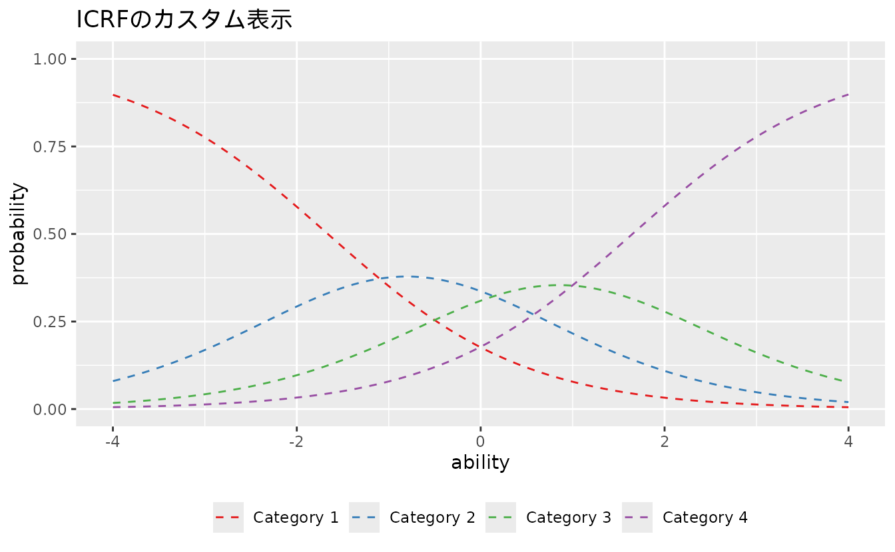

### 例: plotCRV_gg のカスタマイズ

``` r
plotCRV_gg(result_bic,
  title = FALSE,
  linetype = "dotdash",
  show_legend = TRUE,
  legend_position = "top"
)
```


------------------------------------------------------------------------

## 11. combinePlots_gg: 複数プロットの配置

[`combinePlots_gg()`](https://kosugitti.github.io/ggExametrika/reference/combinePlots_gg.md)
は複数のggplotオブジェクトをグリッドレイアウトで配置します。

``` r
# デフォルト: 最初の6つのプロット
plots <- plotICC_gg(result_irt)
combinePlots_gg(plots)
```


``` r

# 特定のプロットを選択
combinePlots_gg(plots, selectPlots = c(1, 3, 5, 7))
```

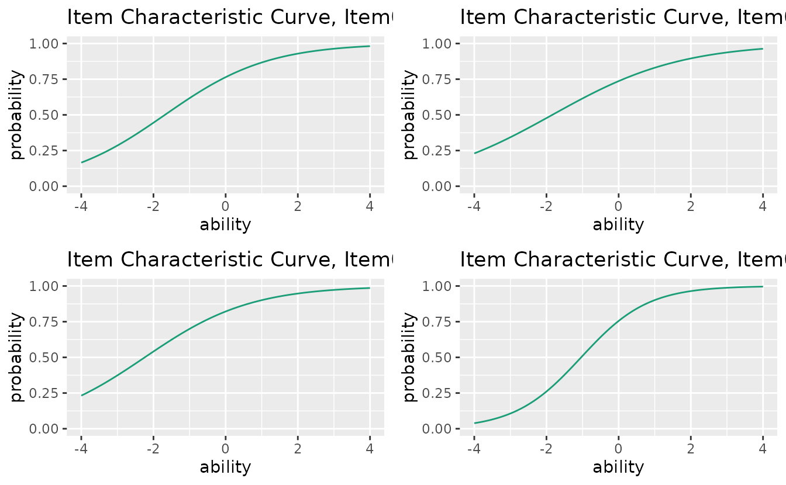

``` r

# 全15項目
combinePlots_gg(plots, selectPlots = 1:15)
```

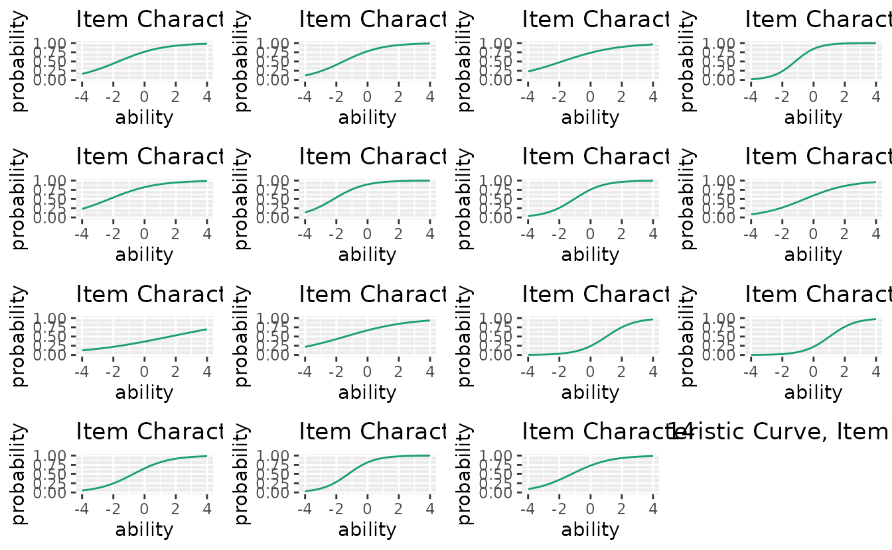

------------------------------------------------------------------------

## 関数-モデル対応表

| 関数               | IRT | GRM | LCA | LRA | LRAord | LRArat | Biclust | nomBiclust | ordBiclust | IRM | LDLRA | LDB | BINET | BNM |
|--------------------|:---:|:---:|:---:|:---:|:------:|:------:|:-------:|:----------:|:----------:|:---:|:-----:|:---:|:-----:|:---:|
| plotICC_gg         |  x  |     |     |     |        |        |         |            |            |     |       |     |       |     |
| plotICC_overlay_gg |  x  |     |     |     |        |        |         |            |            |     |       |     |       |     |
| plotIIC_gg         |  x  |  x  |     |     |        |        |         |            |            |     |       |     |       |     |
| plotIIC_overlay_gg |  x  |  x  |     |     |        |        |         |            |            |     |       |     |       |     |
| plotTIC_gg         |  x  |  x  |     |     |        |        |         |            |            |     |       |     |       |     |
| plotTRF_gg         |  x  |     |     |     |        |        |         |            |            |     |       |     |       |     |
| plotICRF_gg        |     |  x  |     |     |        |        |         |            |            |     |       |     |       |     |
| plotIRP_gg         |     |     |  x  |  x  |        |        |         |            |            |     |   x   |     |       |     |
| plotFRP_gg         |     |     |     |     |        |        |    x    |     x      |     x      |  x  |       |  x  |   x   |     |
| plotTRP_gg         |     |     |  x  |  x  |        |        |    x    |            |            |  x  |   x   |  x  |   x   |     |
| plotLCD_gg         |     |     |  x  |     |        |        |         |            |            |     |       |     |   x   |     |
| plotLRD_gg         |     |     |     |  x  |        |        |    x    |     x      |     x      |     |   x   |  x  |       |     |
| plotCMP_gg         |     |     |  x  |     |        |        |         |            |            |     |       |     |   x   |     |
| plotRMP_gg         |     |     |     |  x  |   x    |   x    |    x    |     x      |     x      |     |   x   |  x  |       |     |
| plotCRV_gg         |     |     |     |     |        |        |    x    |     x      |     x      |     |       |     |       |     |
| plotRRV_gg         |     |     |     |     |        |        |    x    |     x      |     x      |     |       |     |       |     |
| plotArray_gg       |     |     |     |     |        |        |    x    |     x      |     x      |  x  |       |  x  |   x   |     |
| plotFieldPIRP_gg   |     |     |     |     |        |        |         |            |            |     |       |  x  |       |     |
| plotGraph_gg       |     |     |     |     |        |        |         |            |            |     |   x   |  x  |   x   |  x  |
| plotScoreFreq_gg   |     |     |     |     |   x    |   x    |         |            |            |     |       |     |       |     |
| plotScoreRank_gg   |     |     |     |     |   x    |   x    |         |            |            |     |       |     |       |     |
| plotICRP_gg        |     |     |     |     |   x    |   x    |         |            |            |     |       |     |       |     |
| plotICBR_gg        |     |     |     |     |   x    |        |         |            |            |     |       |     |       |     |
| plotFCBR_gg        |     |     |     |     |        |        |         |            |     x      |     |       |     |       |     |
| plotFCRP_gg        |     |     |     |     |        |        |         |     x      |     x      |     |       |     |       |     |
| plotScoreField_gg  |     |     |     |     |        |        |         |     x      |     x      |     |       |     |       |     |
| plotLDPSR_gg       |     |     |     |     |        |        |         |            |            |     |       |     |   x   |     |
