# Getting Started with ggExametrika

## Overview

**ggExametrika** provides ggplot2-based visualization functions for
outputs from the [exametrika](https://kosugitti.github.io/Exametrika/)
package. It covers a wide range of psychometric models including IRT,
GRM, Latent Class/Rank Analysis, Biclustering, Bayesian Network Models,
and more.

## Installation

``` r
# Install from GitHub
devtools::install_github("kosugitti/ggExametrika")
```

## Setup

``` r
library(exametrika)
library(ggExametrika)
#> Loading required package: ggplot2
#> 
#> Attaching package: 'ggExametrika'
#> The following objects are masked from 'package:exametrika':
#> 
#>     ItemInformationFunc, LogisticModel
```

------------------------------------------------------------------------

## 1. IRT (Item Response Theory)

IRT models (2PL, 3PL, 4PL) estimate item parameters for binary response
data.

``` r
result_irt <- IRT(J15S500, model = 2)
#> iter 1 LogLik -3915.61 iter 2 LogLik -3901.1 iter 3 LogLik -3896.89 iter 4
#> LogLik -3894.98 iter 5 LogLik -3894.02 iter 6 LogLik -3893.53 iter 7 LogLik
#> -3893.28 iter 8 LogLik -3893.15 iter 9 LogLik -3893.08 iter 10 LogLik -3893.04
#> iter 11 LogLik -3893.03
```

### plotICC_gg: Item Characteristic Curve

Shows the probability of a correct response as a function of ability
(theta).

``` r
# Returns a list of plots (one per item)
icc_plots <- plotICC_gg(result_irt)
icc_plots[[1]]  # Show first item
```


Use
[`combinePlots_gg()`](https://kosugitti.github.io/ggExametrika/reference/combinePlots_gg.md)
to display multiple items at once:

``` r
combinePlots_gg(icc_plots, selectPlots = 1:6)
```

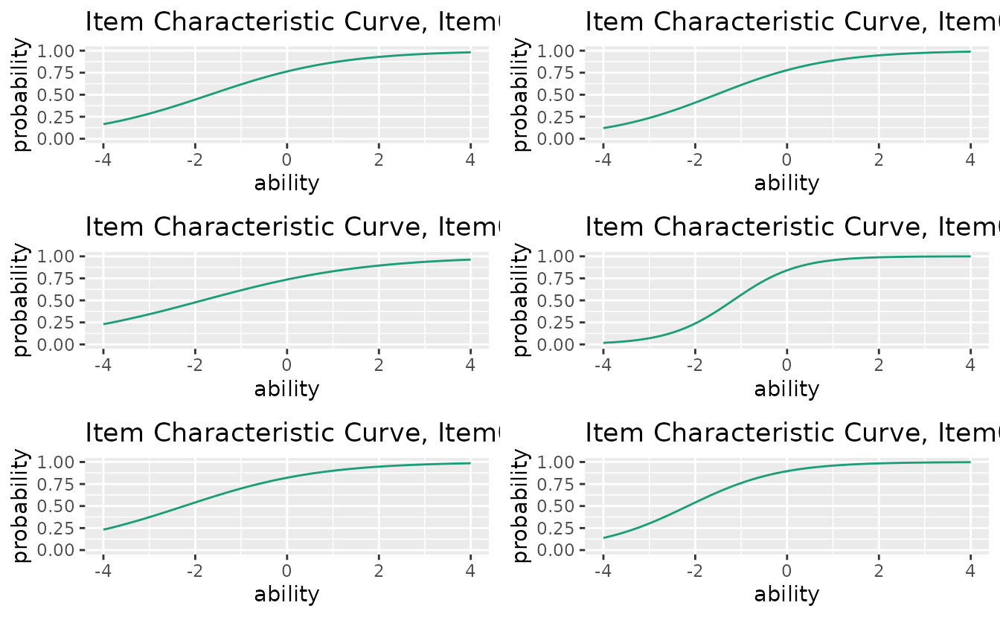

You can customize the ability range:

``` r
icc_plots <- plotICC_gg(result_irt, xvariable = c(-3, 3))
```

### plotIIC_gg: Item Information Curve

Displays how precisely each item measures ability at different theta
levels.

``` r
iic_plots <- plotIIC_gg(result_irt)
iic_plots[[1]]
```


``` r
combinePlots_gg(iic_plots, selectPlots = 1:6)
```

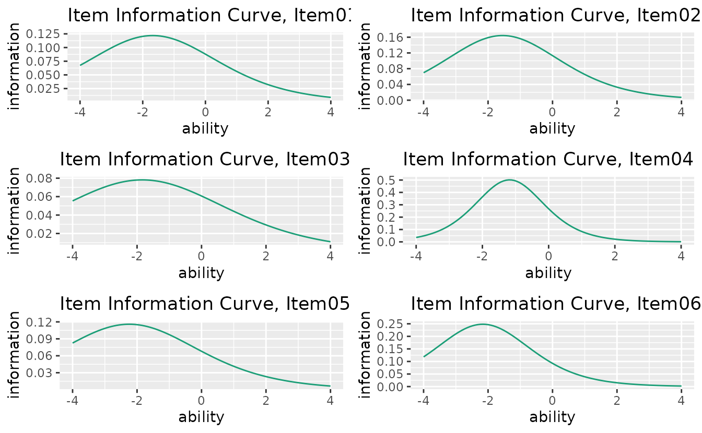

Select specific items:

``` r
iic_plots <- plotIIC_gg(result_irt, items = c(1, 3, 5))
```

### plotTIC_gg: Test Information Curve

Shows the total test information (sum of all item information
functions).

``` r
tic_plot <- plotTIC_gg(result_irt)
tic_plot
```


Customize appearance:

``` r
plotTIC_gg(result_irt,
  title = "Custom Title",
  colors = "darkred",
  linetype = "dashed"
)
```

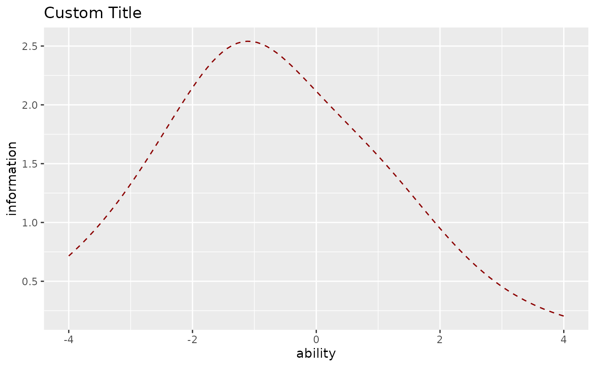

### plotTRF_gg: Test Response Function

Shows the expected total score as a function of ability.

``` r
trf_plot <- plotTRF_gg(result_irt)
trf_plot
```


### plotICC_overlay_gg: ICC Overlay

Overlays all Item Characteristic Curves on a single plot for easy
comparison.

``` r
plotICC_overlay_gg(result_irt)
```

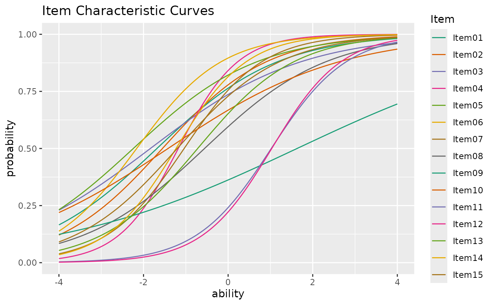

Select specific items and customize:

``` r
plotICC_overlay_gg(result_irt,
  items = c(1, 3, 5, 7),
  title = "Selected ICCs",
  linetype = "solid",
  legend_position = "bottom"
)
```

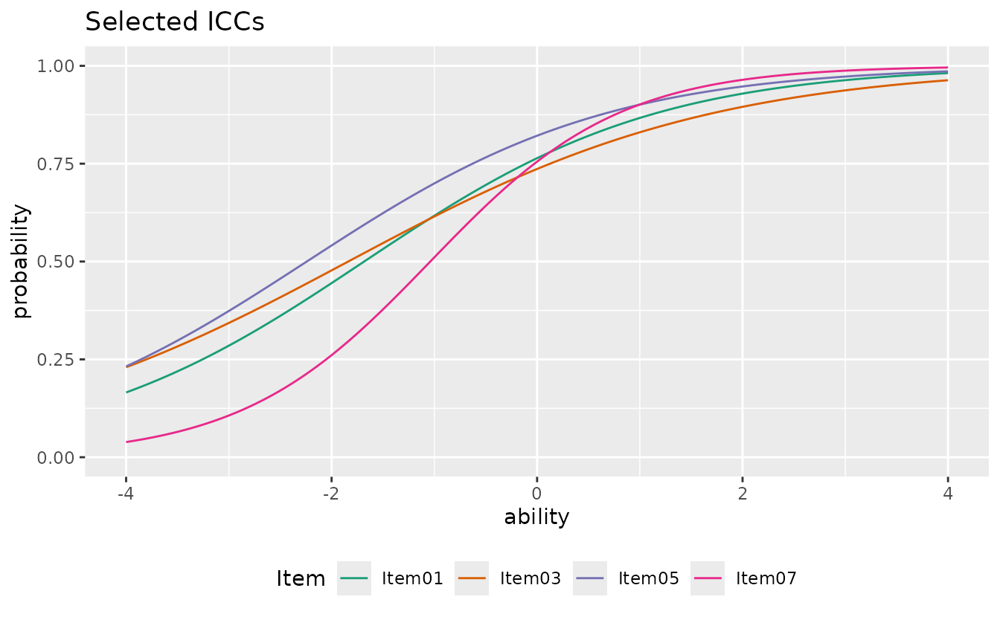

### plotIIC_overlay_gg: IIC Overlay

Overlays all Item Information Curves on a single plot.

``` r
plotIIC_overlay_gg(result_irt)
```


This function also works with GRM (see Section 2).

### LogisticModel / ItemInformationFunc: Helper Functions

Low-level computation functions for IRT models.

``` r
# 4-parameter logistic model: P(theta)
LogisticModel(x = 0, a = 1.5, b = 0.5, c = 0.2, d = 1.0)
#> [1] 0.456657

# Item information at a given theta
ItemInformationFunc(x = 0, a = 1.5, b = 0.5, c = 0.2, d = 1.0)
#> [1] 0.2755452
```

------------------------------------------------------------------------

## 2. GRM (Graded Response Model)

GRM handles ordered polytomous response data (e.g., Likert scales).

``` r
result_grm <- GRM(J5S1000)
#> Parameters: 18 | Initial LL: -6252.352 
#> initial  value 6252.351598 
#> iter  10 value 6032.463982
#> iter  20 value 6010.861094
#> final  value 6008.297278 
#> converged
```

### plotICRF_gg: Item Category Response Function

Displays the probability of each response category as a function of
ability.

``` r
icrf_plots <- plotICRF_gg(result_grm)
icrf_plots[[1]]
```


``` r
combinePlots_gg(icrf_plots, selectPlots = 1:5)
```


Select specific items and customize:

``` r
plotICRF_gg(result_grm,
  items = c(1, 2),
  title = "ICRF for Items 1-2",
  colors = c("#E41A1C", "#377EB8", "#4DAF4A", "#984EA3", "#FF7F00"),
  linetype = "solid",
  show_legend = TRUE,
  legend_position = "bottom"
)
#> [[1]]
```

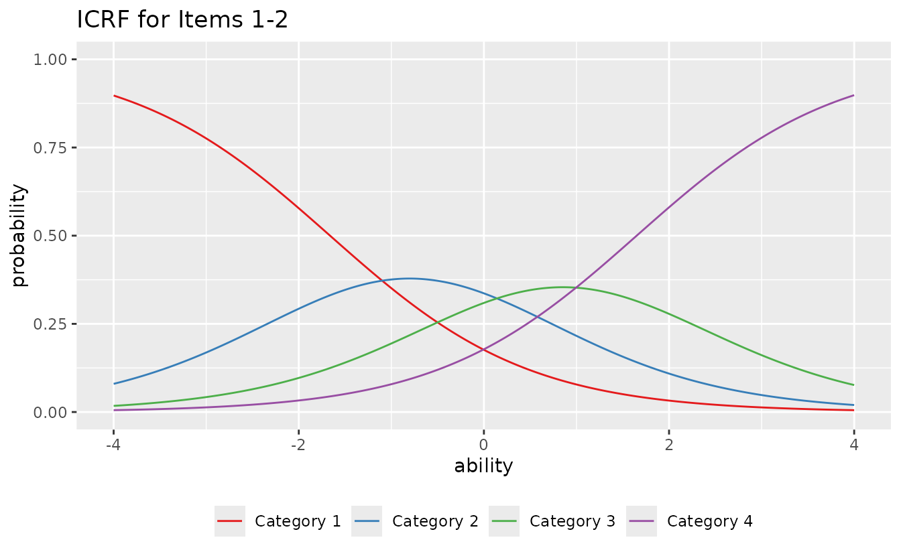

    #> 
    #> [[2]]

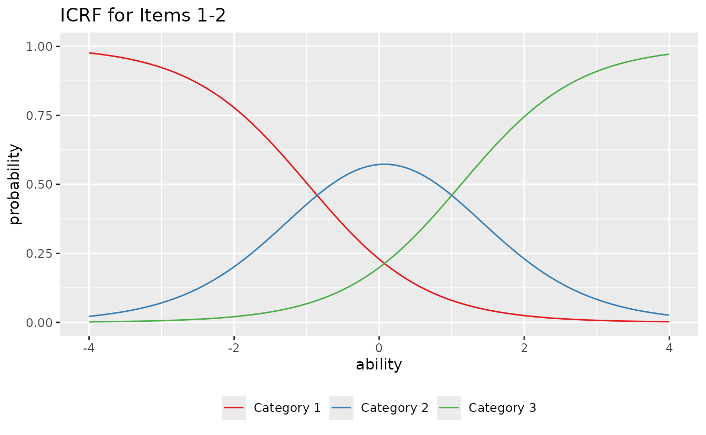

### plotIIC_gg (GRM): Item Information Curve

Also works with GRM data:

``` r
iic_grm <- plotIIC_gg(result_grm)
iic_grm[[1]]
```

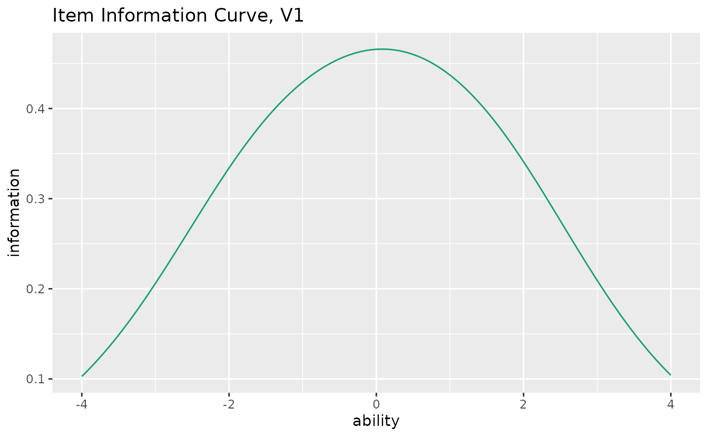

``` r
combinePlots_gg(iic_grm, selectPlots = 1:5)
```

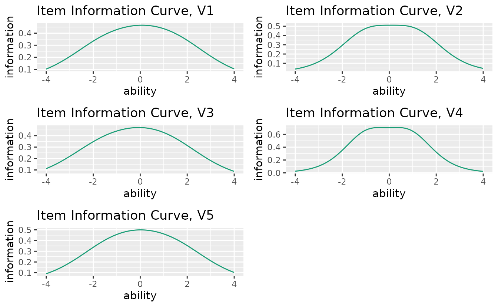

### plotTIC_gg (GRM): Test Information Curve

``` r
tic_grm <- plotTIC_gg(result_grm)
tic_grm
```

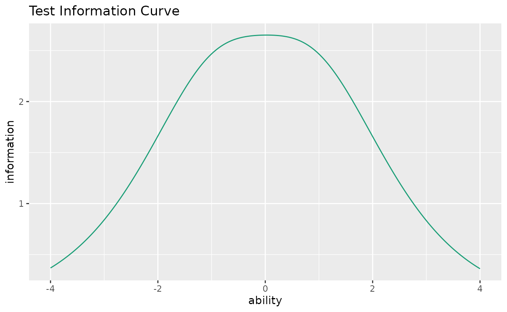

### ItemInformationFunc_GRM: Helper Function

``` r
# Information at theta = 0 for a 5-category item
ItemInformationFunc_GRM(theta = 0, a = 1.5, b = c(-1.5, -0.5, 0.5, 1.5))
#> [1] 1.368688
```

------------------------------------------------------------------------

## 3. LCA (Latent Class Analysis)

LCA identifies latent classes (discrete groups) from binary response
data.

``` r
result_lca <- LCA(J15S500, ncls = 3)
#> iter 1 log_lik -3955.4 iter 2 log_lik -3904.63 iter 3 log_lik -3890.82 iter 4
#> log_lik -3880 iter 5 log_lik -3870.82 iter 6 log_lik -3863.52 iter 7 log_lik
#> -3857.89 iter 8 log_lik -3853.58 iter 9 log_lik -3850.31 iter 10 log_lik
#> -3847.86 iter 11 log_lik -3846.05 iter 12 log_lik -3844.72 iter 13 log_lik
#> -3843.74 iter 14 log_lik -3843.02 iter 15 log_lik -3842.48 iter 16 log_lik
#> -3842.07 iter 17 log_lik -3841.76
```

### plotIRP_gg: Item Reference Profile

Shows the probability of a correct response for each item within each
latent class.

``` r
irp_plots <- plotIRP_gg(result_lca)
irp_plots[[1]]
```

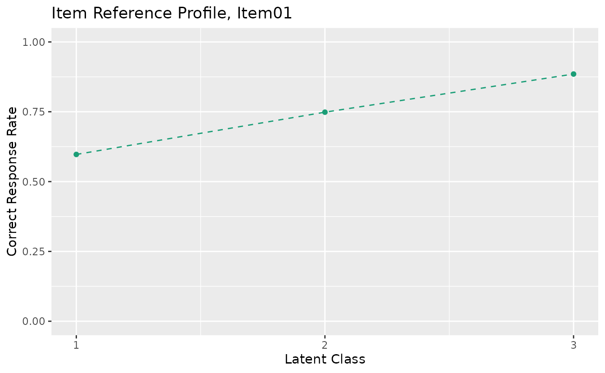

``` r
combinePlots_gg(irp_plots, selectPlots = 1:6)
```

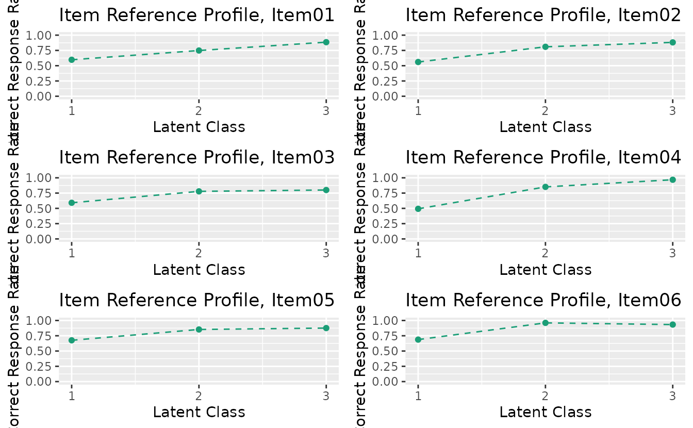

### plotTRP_gg: Test Reference Profile

Displays the number of students and expected test score per class.

``` r
trp_plot <- plotTRP_gg(result_lca)
trp_plot
```


Hide student count labels or title:

``` r
plotTRP_gg(result_lca, Num_Students = FALSE, title = FALSE)
```


### plotLCD_gg: Latent Class Distribution

Displays the class membership distribution.

``` r
lcd_plot <- plotLCD_gg(result_lca)
lcd_plot
```


### plotCMP_gg: Class Membership Profile

Shows the membership probability profile for each student across all
classes.

``` r
# Returns a list of plots (one per student)
cmp_plots <- plotCMP_gg(result_lca)
cmp_plots[[1]]  # First student
```

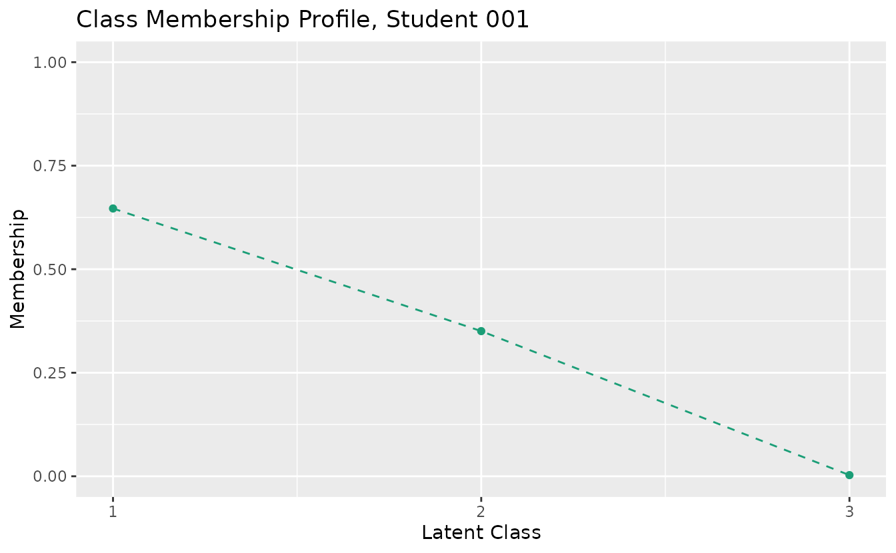

``` r
combinePlots_gg(cmp_plots, selectPlots = 1:6)
```


------------------------------------------------------------------------

## 4. LRA (Latent Rank Analysis)

LRA identifies ordered latent ranks from binary response data.

``` r
result_lra <- LRA(J15S500, nrank = 4)
```

### plotIRP_gg: Item Reference Profile

``` r
irp_plots <- plotIRP_gg(result_lra)
combinePlots_gg(irp_plots, selectPlots = 1:6)
```


### plotTRP_gg: Test Reference Profile

``` r
trp_plot <- plotTRP_gg(result_lra)
trp_plot
```

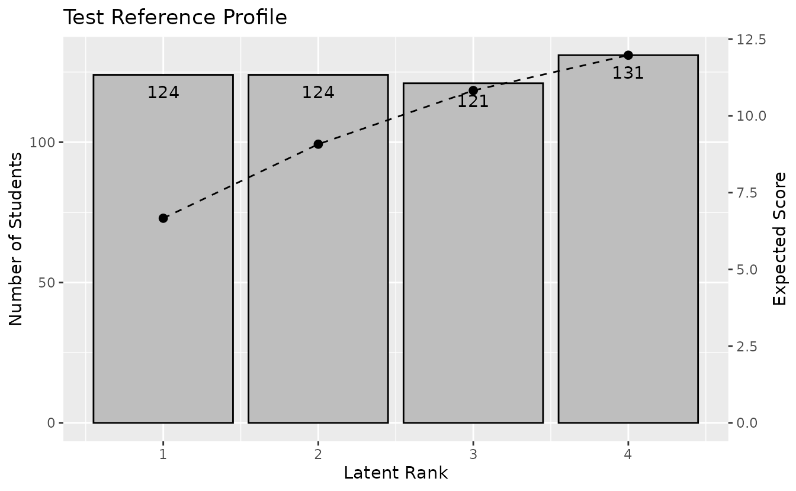

### plotLRD_gg: Latent Rank Distribution

Displays the rank membership distribution.

``` r
lrd_plot <- plotLRD_gg(result_lra)
lrd_plot
```


### plotRMP_gg: Rank Membership Profile

Shows the membership probability profile for each student across all
ranks.

``` r
rmp_plots <- plotRMP_gg(result_lra)
rmp_plots[[1]]
```

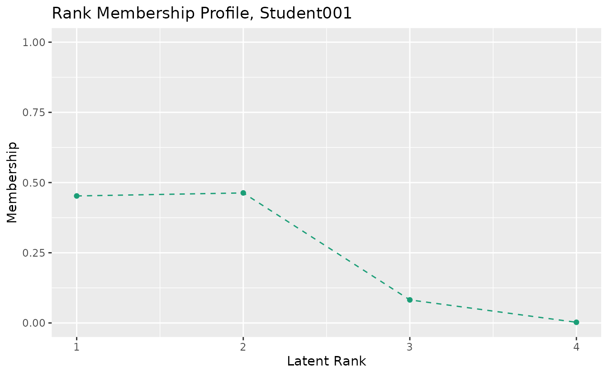

``` r
combinePlots_gg(rmp_plots, selectPlots = 1:6)
```


------------------------------------------------------------------------

## 4b. LRAordinal / LRArated (Polytomous Latent Rank Analysis)

LRAordinal and LRArated handle ordinal and rated polytomous response
data, providing specialized visualizations for score distributions and
category-level analysis.

``` r
result_lra_ord <- LRA(J15S3810, nrank = 4, dataType = "ordinal")
```

### plotScoreFreq_gg: Score Frequency Distribution

Shows the density distribution of scores with vertical lines indicating
rank boundary thresholds.

``` r
plotScoreFreq_gg(result_lra_ord)
```

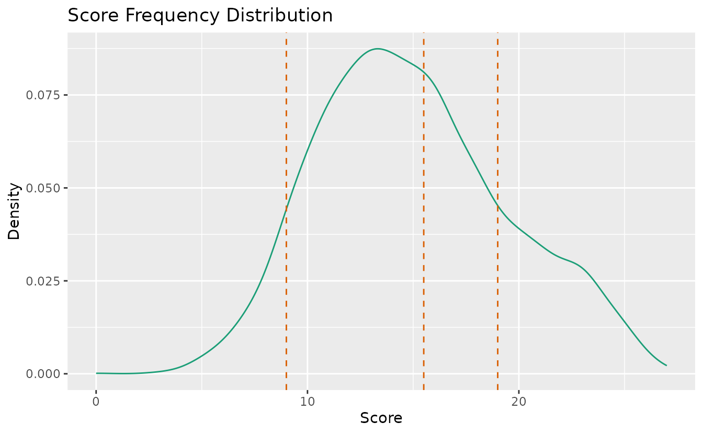

Customize colors and line types:

``` r
plotScoreFreq_gg(result_lra_ord,
  title = "Score Distribution with Rank Boundaries",
  colors = c("steelblue", "red"),
  linetype = c("solid", "dashed")
)
```

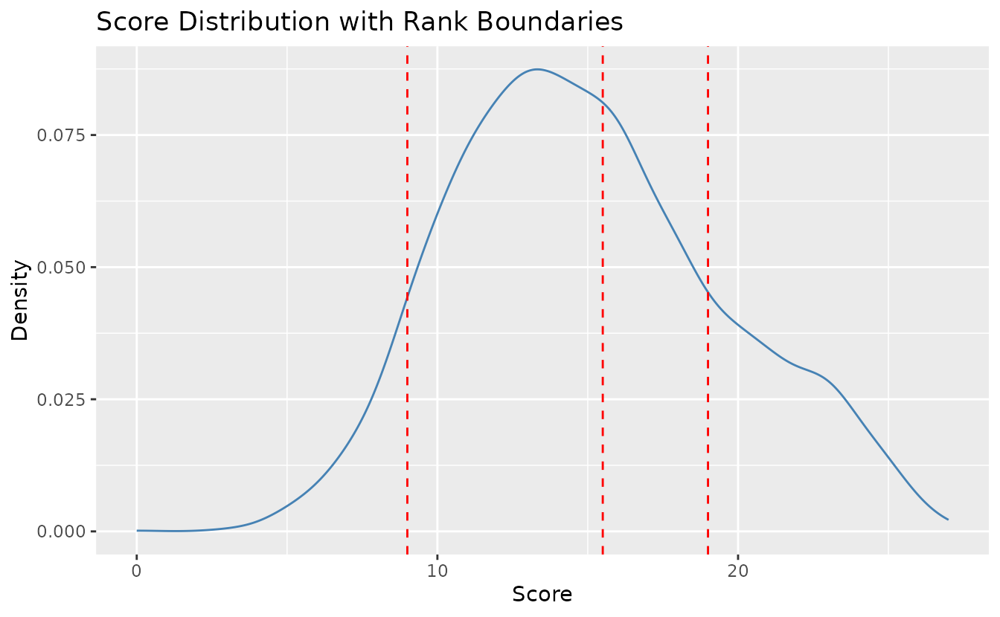

### plotScoreRank_gg: Score-Rank Heatmap

Displays the joint distribution of observed scores and estimated ranks
as a heatmap. Darker cells indicate higher frequency.

``` r
plotScoreRank_gg(result_lra_ord)
```


Customize gradient colors:

``` r
plotScoreRank_gg(result_lra_ord,
  title = "Score-Rank Distribution",
  colors = c("white", "darkblue"),
  legend_position = "bottom"
)
```

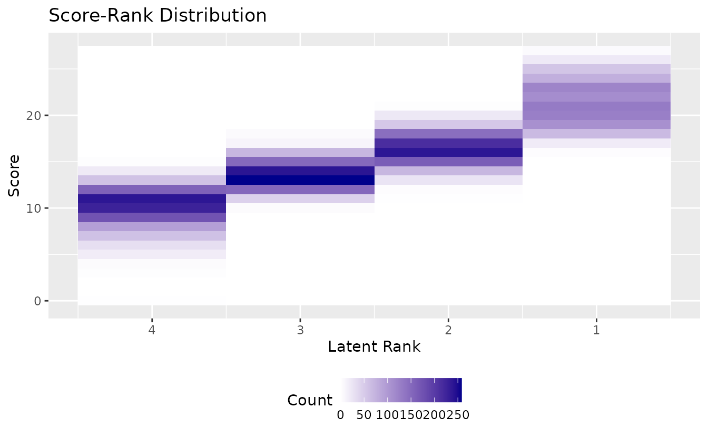

### plotICRP_gg: Item Category Reference Profile

Shows the probability of selecting each response category across latent
ranks. Probabilities at each rank sum to 1.0.

``` r
icrp_plots <- plotICRP_gg(result_lra_ord, items = 1:4)
icrp_plots
```


### plotICBR_gg: Item Category Boundary Response

Shows cumulative probability curves for each category boundary. For an
item with K categories, displays P(response \>= k) for k = 1, …, K-1.

``` r
icbr_plots <- plotICBR_gg(result_lra_ord, items = 1:4)
icbr_plots
```

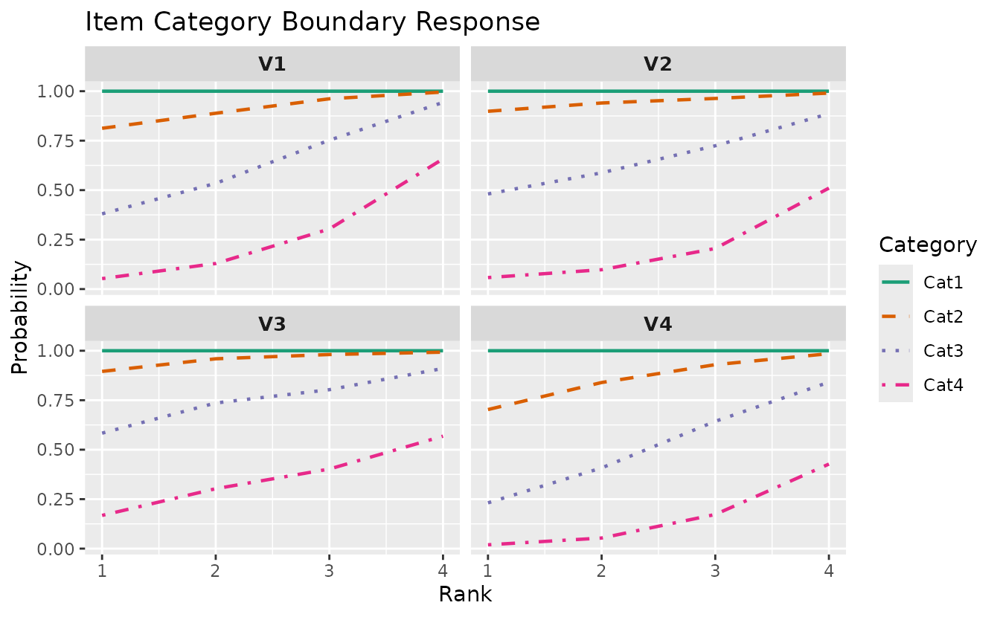

Customize:

``` r
plotICBR_gg(result_lra_ord,
  items = 1:6,
  title = "Item Category Boundary Response",
  legend_position = "bottom"
)
```

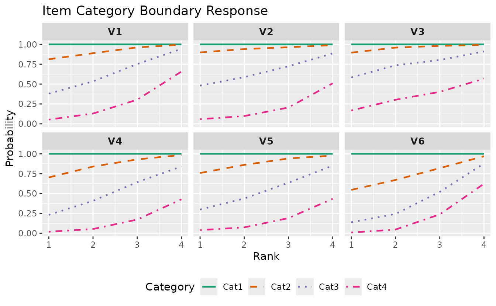

### plotRMP_gg: Rank Membership Profile

Also works with LRAordinal/LRArated:

``` r
rmp_plots <- plotRMP_gg(result_lra_ord)
rmp_plots[[1]]
```


------------------------------------------------------------------------

## 5. Biclustering

Biclustering simultaneously clusters items (into fields) and students
(into ranks).

``` r
result_bic <- Biclustering(J35S515, nfld = 5, nrank = 6)
#> Biclustering is chosen.
#> iter 1 log_lik -8463.81                                                         iter 2 log_lik -8195.78                                                         iter 3 log_lik -8121.09                                                         iter 4 log_lik -8091.3                                                          iter 5 log_lik -8086.61                                                         iter 6 log_lik -8086.47                                                         
#> 
#> Strongly ordinal alignment condition was satisfied.
```

### plotFRP_gg: Field Reference Profile

``` r
frp_plot <- plotFRP_gg(result_bic)
frp_plot
```

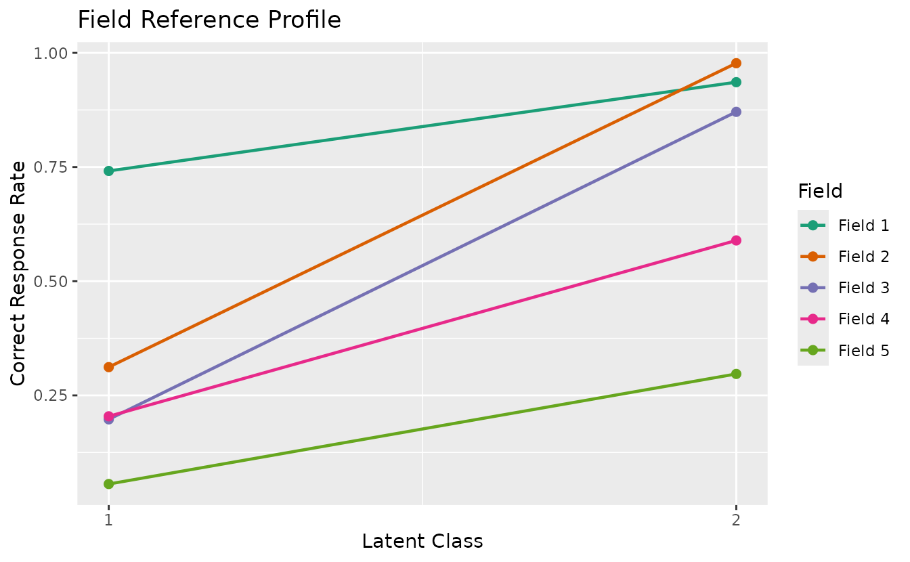

### plotTRP_gg: Test Reference Profile

``` r
trp_plot <- plotTRP_gg(result_bic)
trp_plot
```

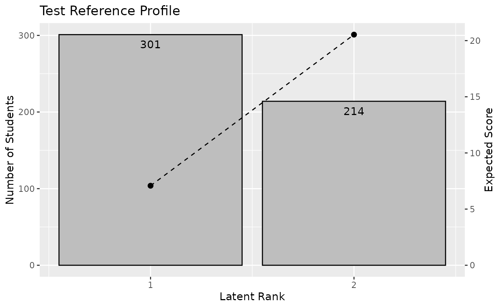

### plotLRD_gg: Latent Rank Distribution

``` r
lrd_plot <- plotLRD_gg(result_bic)
lrd_plot
```

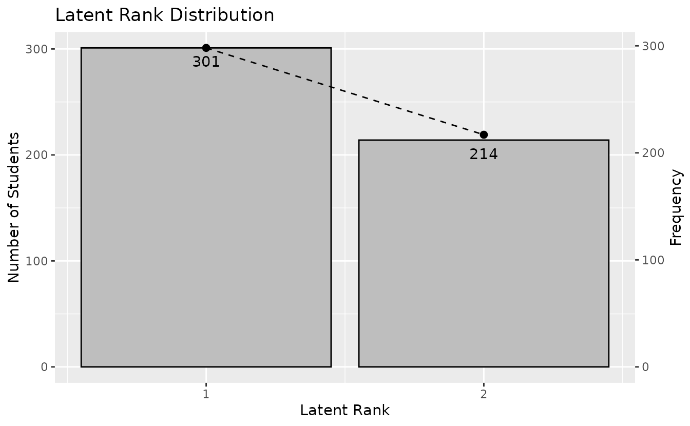

### plotRMP_gg: Rank Membership Profile

``` r
rmp_plots <- plotRMP_gg(result_bic)
combinePlots_gg(rmp_plots, selectPlots = 1:6)
```

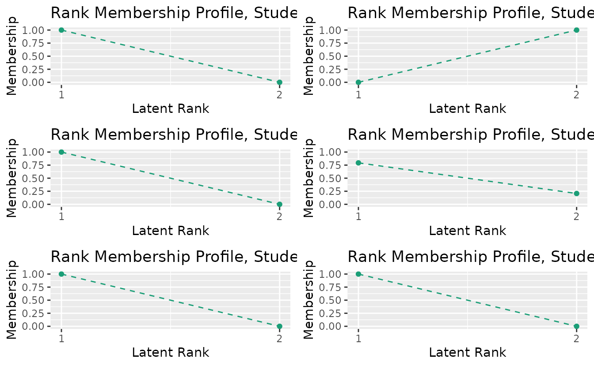

### plotCRV_gg: Class Reference Vector

Displays all class profiles in a single plot with one line per class.

``` r
crv_plot <- plotCRV_gg(result_bic)
crv_plot
```


Customize:

``` r
plotCRV_gg(result_bic,
  title = "Class Reference Vector",
  linetype = "dashed",
  legend_position = "bottom"
)
```

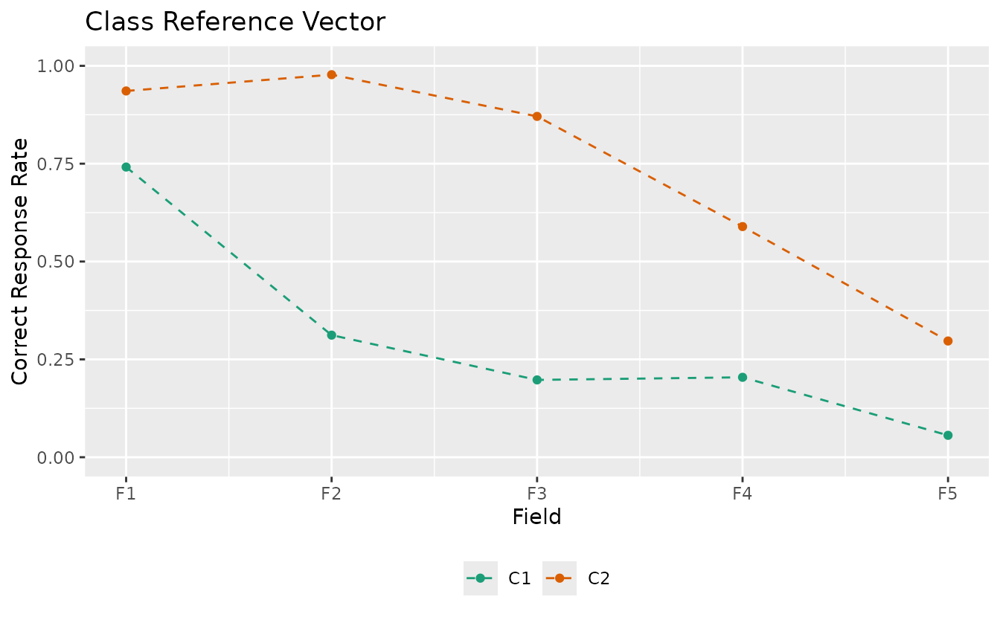

### plotRRV_gg: Rank Reference Vector

Displays all rank profiles in a single plot with one line per rank.

``` r
rrv_plot <- plotRRV_gg(result_bic)
rrv_plot
```


### plotArray_gg: Array Plot

Visualizes the binary data matrix as a heatmap, showing the
block-diagonal structure after biclustering.

``` r
# Show both original and clustered arrays
array_plot <- plotArray_gg(result_bic)
```

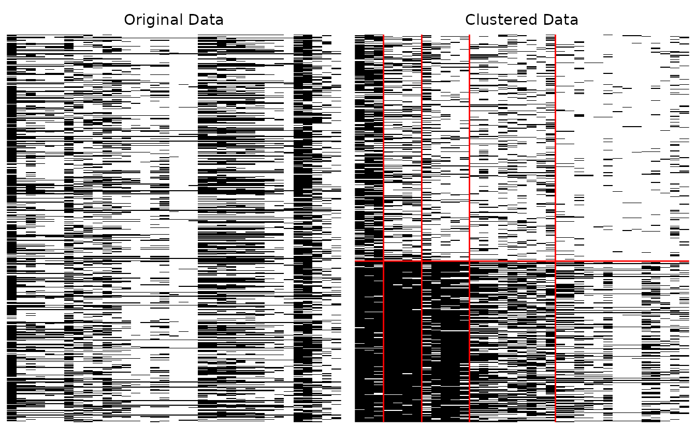

``` r
array_plot
#> TableGrob (1 x 2) "arrange": 2 grobs
#>   z     cells    name           grob
#> 1 1 (1-1,1-1) arrange gtable[layout]
#> 2 2 (1-1,2-2) arrange gtable[layout]
```

Show only the clustered array:

``` r
plotArray_gg(result_bic, Original = FALSE, Clusterd = TRUE)
#> [[1]]
```

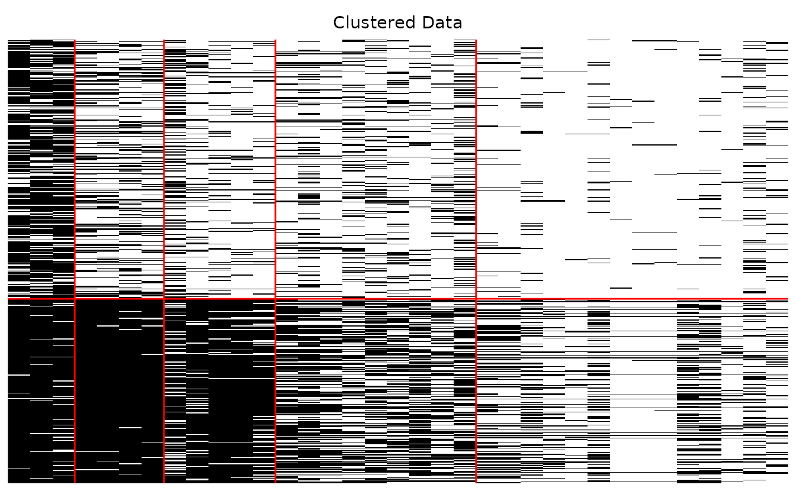

Hide cluster boundary lines:

``` r
plotArray_gg(result_bic, Clusterd_lines = FALSE)
```


    #> TableGrob (1 x 2) "arrange": 2 grobs
    #>   z     cells    name           grob
    #> 1 1 (1-1,1-1) arrange gtable[layout]
    #> 2 2 (1-1,2-2) arrange gtable[layout]

### Ordinal Biclustering: plotFCBR_gg

For ordinal (polytomous) biclustering,
[`plotFCBR_gg()`](https://kosugitti.github.io/ggExametrika/reference/plotFCBR_gg.md)
visualizes the Field Cumulative Boundary Reference. It shows boundary
probabilities P(Q \>= k) for each field across latent classes/ranks.

``` r
result_ord_bic <- Biclustering(J35S500, ncls = 5, nfld = 5)
#> Biclustering is chosen.
#> iter 1 log_lik -22710.5 iter 2 log_lik -21311.9 iter 3 log_lik -21002.5 iter 4
#> log_lik -20945.8 iter 5 log_lik -20932.3 iter 6 log_lik -20929.2 iter 7 log_lik
#> -20929.8
```

``` r
fcbr_plot <- plotFCBR_gg(result_ord_bic)
fcbr_plot
```

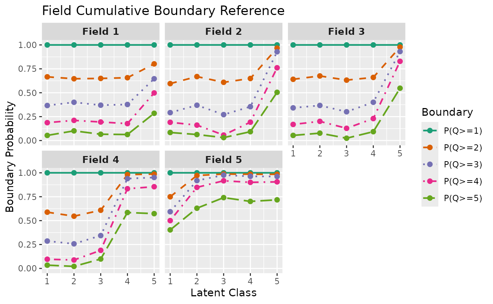

Select specific fields and customize:

``` r
plotFCBR_gg(result_ord_bic,
  fields = 1:4,
  title = "Field Cumulative Boundary Reference",
  legend_position = "bottom"
)
```

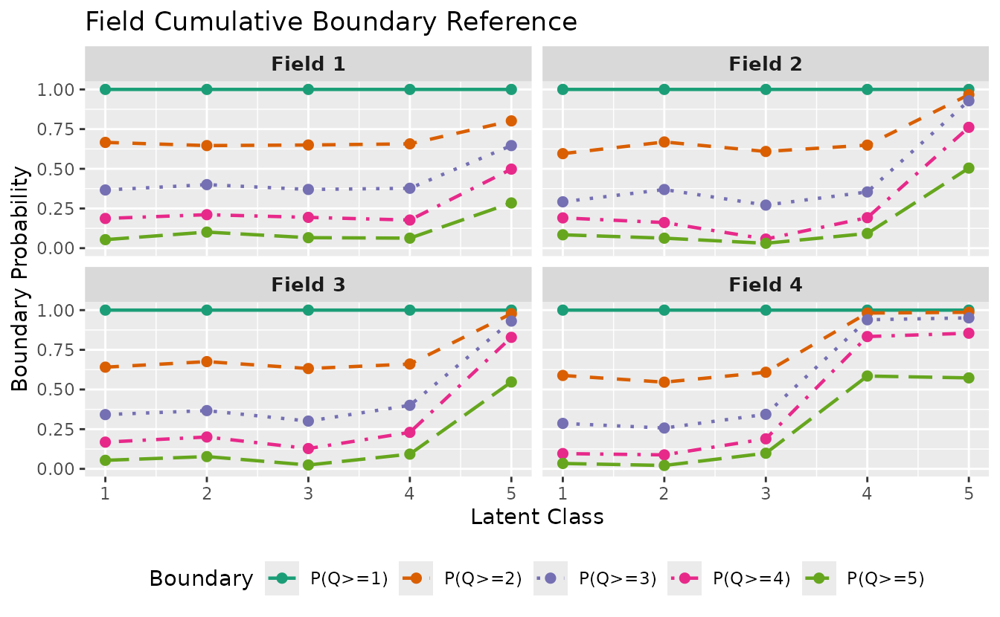

------------------------------------------------------------------------

## 6. BNM (Bayesian Network Model)

BNM discovers the dependency structure among items using a Bayesian
network.

``` r
result_bnm <- BNM(J15S500)
```

### plotGraph_gg: DAG Visualization

Visualizes the Directed Acyclic Graph (DAG) discovered by the model.

``` r
dag_plots <- plotGraph_gg(result_bnm)
dag_plots[[1]]
```

Customize layout and appearance:

``` r
plotGraph_gg(result_bnm,
  layout = "sugiyama",
  direction = "LR",
  node_size = 10,
  label_size = 4,
  title = "BNM DAG"
)
```

Available layouts: `"sugiyama"` (hierarchical), `"fr"`
(Fruchterman-Reingold), `"kk"` (Kamada-Kawai), `"tree"`, `"circle"`,
`"grid"`, `"stress"`.

------------------------------------------------------------------------

## 7. LDLRA (Locally Dependent Latent Rank Analysis)

LDLRA adds local dependency structures within each rank.

``` r
result_ldlra <- LDLRA(J15S500, ncls = 5)
```

### plotIRP_gg: Item Reference Profile

``` r
irp_plots <- plotIRP_gg(result_ldlra)
combinePlots_gg(irp_plots, selectPlots = 1:6)
```

### plotLRD_gg: Latent Rank Distribution

``` r
lrd_plot <- plotLRD_gg(result_ldlra)
lrd_plot
```

### plotRMP_gg: Rank Membership Profile

``` r
rmp_plots <- plotRMP_gg(result_ldlra)
combinePlots_gg(rmp_plots, selectPlots = 1:6)
```

### plotGraph_gg: DAG per Rank

Returns one DAG per rank, showing how dependencies change across ranks.
*(DAG visualization for LDLRA is coming soon.)*

``` r
dag_plots <- plotGraph_gg(result_ldlra)
dag_plots[[1]]  # Rank 1 DAG
combinePlots_gg(dag_plots)
```

------------------------------------------------------------------------

## 8. LDB (Locally Dependent Biclustering)

LDB adds local dependency structures to the biclustering framework.

``` r
result_ldb <- LDB(J35S515, ncls = 6, nfld = 5)
```

### plotFRP_gg: Field Reference Profile

``` r
frp_plot <- plotFRP_gg(result_ldb)
frp_plot
```

### plotTRP_gg: Test Reference Profile

``` r
trp_plot <- plotTRP_gg(result_ldb)
trp_plot
```

### plotLRD_gg: Latent Rank Distribution

``` r
lrd_plot <- plotLRD_gg(result_ldb)
lrd_plot
```

### plotRMP_gg: Rank Membership Profile

``` r
rmp_plots <- plotRMP_gg(result_ldb)
combinePlots_gg(rmp_plots, selectPlots = 1:6)
```

### plotArray_gg: Array Plot

``` r
array_plot <- plotArray_gg(result_ldb)
array_plot
```

### plotFieldPIRP_gg: Field Parent Item Reference Profile

Shows how field performance varies based on parent field scores, for
each rank.

``` r
fpirp_plots <- plotFieldPIRP_gg(result_ldb)
fpirp_plots[[1]]  # Rank 1
combinePlots_gg(fpirp_plots)
```

### plotGraph_gg: DAG per Rank

*(DAG visualization for LDB is coming soon.)*

``` r
dag_plots <- plotGraph_gg(result_ldb)
dag_plots[[1]]
combinePlots_gg(dag_plots)
```

------------------------------------------------------------------------

## 9. BINET (Bayesian Network and Test)

BINET combines Bayesian network structure with the biclustering
framework.

``` r
result_binet <- BINET(J35S515, ncls = 6, nfld = 5)
```

### plotFRP_gg: Field Reference Profile

``` r
frp_plot <- plotFRP_gg(result_binet)
frp_plot
```

### plotTRP_gg: Test Reference Profile

``` r
trp_plot <- plotTRP_gg(result_binet)
trp_plot
```

### plotLCD_gg: Latent Class Distribution

``` r
lcd_plot <- plotLCD_gg(result_binet)
lcd_plot
```

### plotCMP_gg: Class Membership Profile

``` r
cmp_plots <- plotCMP_gg(result_binet)
combinePlots_gg(cmp_plots, selectPlots = 1:6)
```

### plotArray_gg: Array Plot

``` r
array_plot <- plotArray_gg(result_binet)
array_plot
```

### plotGraph_gg: DAG Visualization

BINET supports edge labels showing dependency weights. *(DAG
visualization for BINET is coming soon.)*

``` r
dag_plots <- plotGraph_gg(result_binet)
dag_plots[[1]]
```

------------------------------------------------------------------------

## 10. Common Plot Options

Many functions support the following options for customization:

| Parameter         | Description                                         | Default                     |
|-------------------|-----------------------------------------------------|-----------------------------|
| `title`           | `TRUE` (auto), `FALSE` (none), or character string  | `TRUE`                      |
| `colors`          | Color vector for lines/bars                         | Colorblind-friendly palette |
| `linetype`        | Line type (`"solid"`, `"dashed"`, `"dotted"`, etc.) | `"solid"`                   |
| `show_legend`     | Show/hide legend                                    | `TRUE`                      |
| `legend_position` | `"right"`, `"top"`, `"bottom"`, `"left"`, `"none"`  | `"right"`                   |

### Example: Customizing plotICRF_gg

``` r
plotICRF_gg(result_grm,
  items = 1,
  title = "Custom ICRF Title",
  colors = c("#E41A1C", "#377EB8", "#4DAF4A", "#984EA3", "#FF7F00"),
  linetype = "dashed",
  show_legend = TRUE,
  legend_position = "bottom"
)
#> [[1]]
```

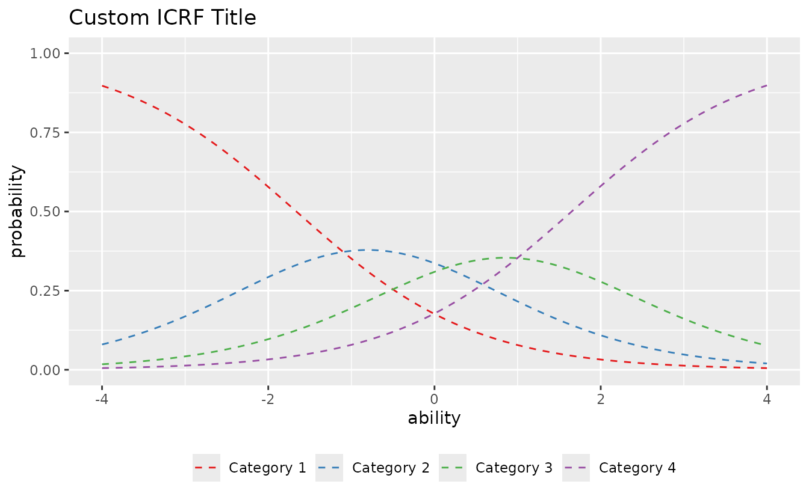

### Example: Customizing plotCRV_gg

``` r
plotCRV_gg(result_bic,
  title = FALSE,
  linetype = "dotdash",
  show_legend = TRUE,
  legend_position = "top"
)
```

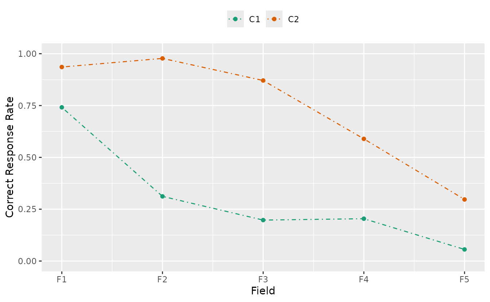

------------------------------------------------------------------------

## 11. combinePlots_gg: Arranging Multiple Plots

[`combinePlots_gg()`](https://kosugitti.github.io/ggExametrika/reference/combinePlots_gg.md)
arranges multiple ggplot objects in a grid layout.

``` r
# Default: first 6 plots
plots <- plotICC_gg(result_irt)
combinePlots_gg(plots)
```


``` r

# Select specific plots
combinePlots_gg(plots, selectPlots = c(1, 3, 5, 7))
```


``` r

# All 15 items
combinePlots_gg(plots, selectPlots = 1:15)
```


------------------------------------------------------------------------

## Function-Model Compatibility Matrix

| Function           | IRT | GRM | LCA | LRA | LRAord | LRArat | Biclust | nomBiclust | ordBiclust | IRM | LDLRA | LDB | BINET | BNM |
|--------------------|:---:|:---:|:---:|:---:|:------:|:------:|:-------:|:----------:|:----------:|:---:|:-----:|:---:|:-----:|:---:|
| plotICC_gg         |  x  |     |     |     |        |        |         |            |            |     |       |     |       |     |
| plotICC_overlay_gg |  x  |     |     |     |        |        |         |            |            |     |       |     |       |     |
| plotIIC_gg         |  x  |  x  |     |     |        |        |         |            |            |     |       |     |       |     |
| plotIIC_overlay_gg |  x  |  x  |     |     |        |        |         |            |            |     |       |     |       |     |
| plotTIC_gg         |  x  |  x  |     |     |        |        |         |            |            |     |       |     |       |     |
| plotTRF_gg         |  x  |     |     |     |        |        |         |            |            |     |       |     |       |     |
| plotICRF_gg        |     |  x  |     |     |        |        |         |            |            |     |       |     |       |     |
| plotIRP_gg         |     |     |  x  |  x  |        |        |         |            |            |     |   x   |     |       |     |
| plotFRP_gg         |     |     |     |     |        |        |    x    |     x      |     x      |  x  |       |  x  |   x   |     |
| plotTRP_gg         |     |     |  x  |  x  |        |        |    x    |            |            |  x  |   x   |  x  |   x   |     |
| plotLCD_gg         |     |     |  x  |     |        |        |         |            |            |     |       |     |   x   |     |
| plotLRD_gg         |     |     |     |  x  |        |        |    x    |     x      |     x      |     |   x   |  x  |       |     |
| plotCMP_gg         |     |     |  x  |     |        |        |         |            |            |     |       |     |   x   |     |
| plotRMP_gg         |     |     |     |  x  |   x    |   x    |    x    |     x      |     x      |     |   x   |  x  |       |     |
| plotCRV_gg         |     |     |     |     |        |        |    x    |     x      |     x      |     |       |     |       |     |
| plotRRV_gg         |     |     |     |     |        |        |    x    |     x      |     x      |     |       |     |       |     |
| plotArray_gg       |     |     |     |     |        |        |    x    |     x      |     x      |  x  |       |  x  |   x   |     |
| plotFieldPIRP_gg   |     |     |     |     |        |        |         |            |            |     |       |  x  |       |     |
| plotGraph_gg       |     |     |     |     |        |        |         |            |            |     |   x   |  x  |   x   |  x  |
| plotScoreFreq_gg   |     |     |     |     |   x    |   x    |         |            |            |     |       |     |       |     |
| plotScoreRank_gg   |     |     |     |     |   x    |   x    |         |            |            |     |       |     |       |     |
| plotICRP_gg        |     |     |     |     |   x    |   x    |         |            |            |     |       |     |       |     |
| plotICBR_gg        |     |     |     |     |   x    |        |         |            |            |     |       |     |       |     |
| plotFCBR_gg        |     |     |     |     |        |        |         |            |     x      |     |       |     |       |     |
| plotFCRP_gg        |     |     |     |     |        |        |         |     x      |     x      |     |       |     |       |     |
| plotScoreField_gg  |     |     |     |     |        |        |         |     x      |     x      |     |       |     |       |     |
| plotLDPSR_gg       |     |     |     |     |        |        |         |            |            |     |       |     |   x   |     |
